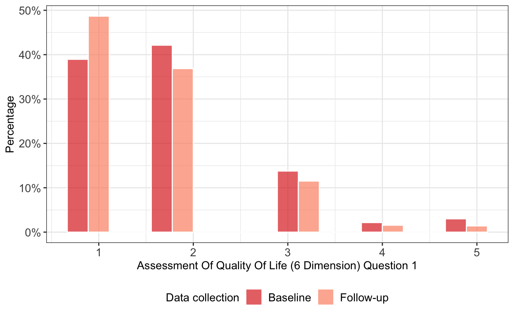
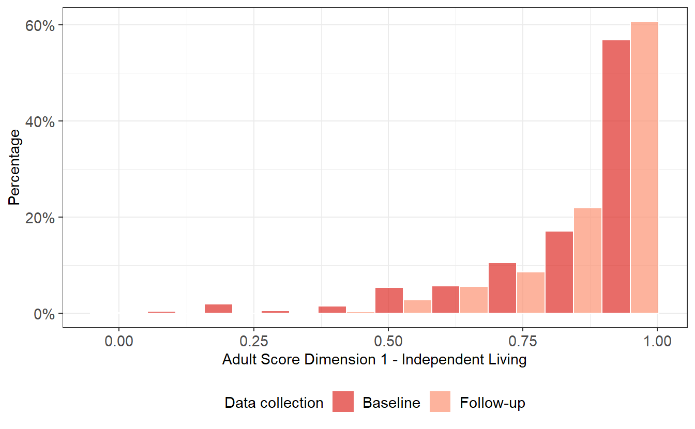
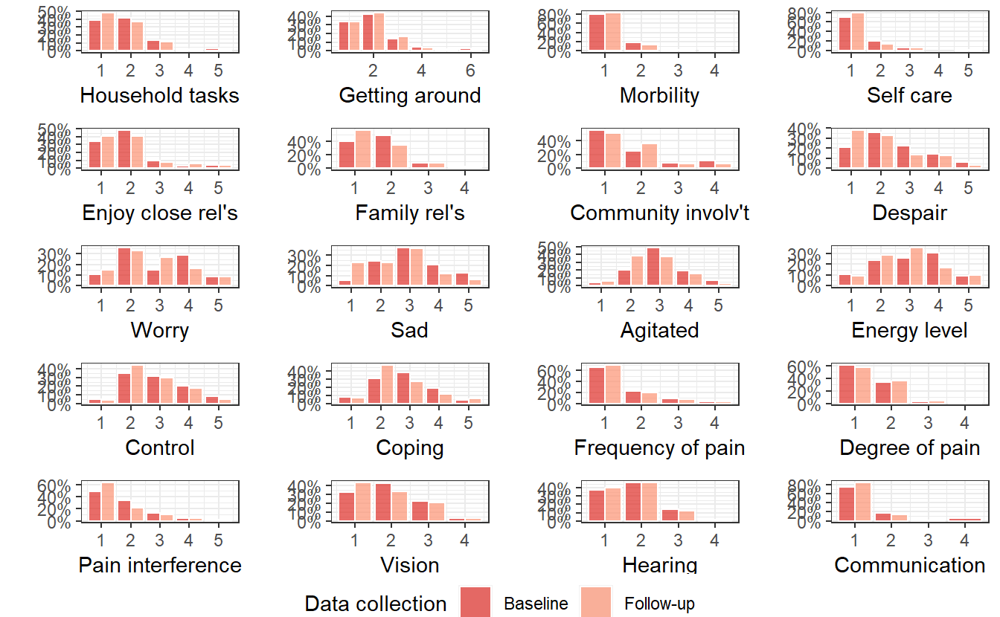
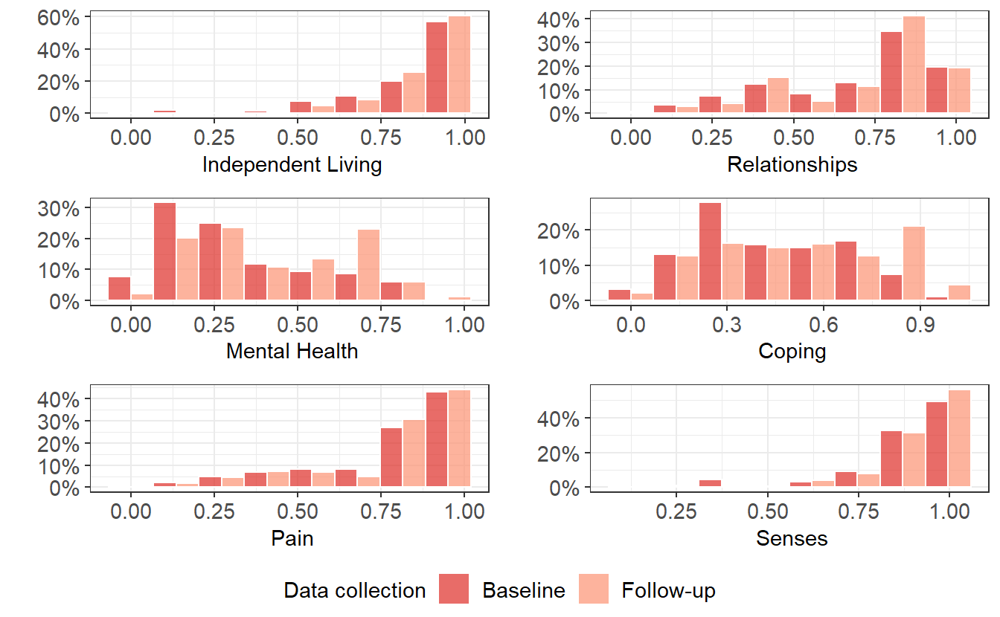

{} This below section renders a vignette article from the scorz library. You can use the following links to:

-   [view the vignette on the library website (adds useful hyperlinks to code blocks)](https://ready4-dev.github.io/scorz/articles/V_01.html)
-   [view the source file](https://github.com/ready4-dev/scorz/blob/main/vignettes/V_01.Rmd) from that article, and;
-   [edit its contents](https://github.com/ready4-dev/scorz/edit/main/vignettes/V_01.Rmd) (requires a GitHub account). {}

Note: **This vignette is illustrated with fake data**. The dataset explored in this example should not be used to inform decision-making. Some of the methods illustrated in this AQoL-6D vignette can also be used to score other health utility instruments - see [a vignette about scoring EQ-5D](https://ready4-dev.github.io/scorz/articles/V_02.html).

<pre class='chroma'><code class='language-r' data-lang='r'><a href='https://rdrr.io/r/base/library.html'>library</a>(<a href='https://ready4-dev.github.io/ready4/'>ready4</a>)
<a href='https://rdrr.io/r/base/library.html'>library</a>(<a href='https://ready4-dev.github.io/scorz/'>scorz</a>)</code></pre>

## AQoL-6D scoring

To derive a health utility score from the raw responses to a multi-attribute utility instrument it is necessary to implement a scoring algorithm. Scoring algorithms for the Assessment of Quality of Life Six Dimension (AQoL-6D) are publicly available in SPSS format (<https://www.aqol.com.au/index.php/scoring-algorithms>).

However, to include scoring algorithms in reproducible research workflows, it is desirable to have these algorithms available in open science languages such as R. The `scorz` package includes [ready4 framework model modules](https://www.ready4-dev.com/docs/framework/implementation/modularity/#ready4-model-modules) of [the ready4 youth mental health economic model](https://www.ready4-dev.com/docs/model/) that provide R implementations of the adult and adolescent versions of the AQoL-6D scoring algorithms.

## Ingest data

To begin, we ingest an unscored dataset as an instance of the `Ready4useDyad` from the [ready4use package](https://ready4-dev.github.io/ready4use/). In this case we download our data from a remote repository.

<pre class='chroma'><code class='language-r' data-lang='r'>X &lt;- ready4use::<a href='https://ready4-dev.github.io/ready4use/reference/Ready4useRepos-class.html'>Ready4useRepos</a>(dv_nm_1L_chr = "fakes",
                               dv_ds_nm_1L_chr = "https://doi.org/10.7910/DVN/W95KED",
                               dv_server_1L_chr = "dataverse.harvard.edu") <a href='https://magrittr.tidyverse.org/reference/pipe.html'>%&gt;%</a>
  <a href='https://ready4-dev.github.io/ready4/reference/ingest-methods.html'>ingest</a>(fls_to_ingest_chr = "ymh_clinical_dyad_r4",
         metadata_1L_lgl = F) </code></pre>

To make the ingested dataset easier to interpret, we can add labels from the dictionary.

<pre class='chroma'><code class='language-r' data-lang='r'>X &lt;- X <a href='https://magrittr.tidyverse.org/reference/pipe.html'>%&gt;%</a>
  <a href='https://ready4-dev.github.io/ready4/reference/renew-methods.html'>renew</a>(type_1L_chr = "label")</code></pre>

We can now inspect our ingested dataset using the `exhibit` method.

<pre class='chroma'><code class='language-r' data-lang='r'><a href='https://ready4-dev.github.io/ready4/reference/exhibit-methods.html'>exhibit</a>(X,
        display_1L_chr = "head",
         scroll_box_args_ls = <a href='https://rdrr.io/r/base/list.html'>list</a>(width = "100%"))
</code></pre>

<table class=" lightable-paper lightable-hover lightable-paper" style="font-family: &quot;Arial Narrow&quot;, arial, helvetica, sans-serif; width: auto !important; margin-left: auto; margin-right: auto;border-bottom: 0; font-family: &quot;Arial Narrow&quot;, arial, helvetica, sans-serif; margin-left: auto; margin-right: auto;">
<caption>
Dataset
</caption>
<thead>
<tr>
<th style="text-align:left;">
Unique client identifier
</th>
<th style="text-align:right;">
Round of data collection
</th>
<th style="text-align:right;">
Date of data collection
</th>
<th style="text-align:right;">
Age
</th>
<th style="text-align:right;">
Gender
</th>
<th style="text-align:right;">
Sex at birth
</th>
<th style="text-align:left;">
Sexual orientation
</th>
<th style="text-align:right;">
Aboriginal or Torres Strait Islander
</th>
<th style="text-align:right;">
Country Of birth
</th>
<th style="text-align:right;">
Speaks English at home
</th>
<th style="text-align:right;">
Native English speaker
</th>
<th style="text-align:right;">
Education and employment status
</th>
<th style="text-align:left;">
Relationship status
</th>
<th style="text-align:right;">
Service centre name
</th>
<th style="text-align:right;">
Primary diagnosis
</th>
<th style="text-align:right;">
Clinical stage
</th>
<th style="text-align:right;">
Kessler Psychological Distress Scale (6 Dimension)
</th>
<th style="text-align:right;">
Patient Health Questionnaire
</th>
<th style="text-align:left;">
Behavioural Activation for Depression Scale
</th>
<th style="text-align:right;">
Generalised Anxiety Disorder Scale
</th>
<th style="text-align:right;">
Overall Anxiety Severity and Impairment Scale
</th>
<th style="text-align:right;">
Screen for Child Anxiety Related Disorders
</th>
<th style="text-align:right;">
Social and Occupational Functioning Assessment Scale
</th>
<th style="text-align:right;">
Assessment of Quality of Life (6 Dimension) question 1
</th>
<th style="text-align:left;">
Assessment of Quality of Life (6 Dimension) question 2
</th>
<th style="text-align:right;">
Assessment of Quality of Life (6 Dimension) question 3
</th>
<th style="text-align:right;">
Assessment of Quality of Life (6 Dimension) question 4
</th>
<th style="text-align:right;">
Assessment of Quality of Life (6 Dimension) question 5
</th>
<th style="text-align:right;">
Assessment of Quality of Life (6 Dimension) question 6
</th>
<th style="text-align:right;">
Assessment of Quality of Life (6 Dimension) question 7
</th>
<th style="text-align:left;">
Assessment of Quality of Life (6 Dimension) question 8
</th>
<th style="text-align:right;">
Assessment of Quality of Life (6 Dimension) question 9
</th>
<th style="text-align:right;">
Assessment of Quality of Life (6 Dimension) question 10
</th>
<th style="text-align:right;">
Assessment of Quality of Life (6 Dimension) question 11
</th>
<th style="text-align:right;">
Assessment of Quality of Life (6 Dimension) question 12
</th>
<th style="text-align:right;">
Assessment of Quality of Life (6 Dimension) question 13
</th>
<th style="text-align:left;">
Assessment of Quality of Life (6 Dimension) question 14
</th>
<th style="text-align:right;">
Assessment of Quality of Life (6 Dimension) question 15
</th>
<th style="text-align:right;">
Assessment of Quality of Life (6 Dimension) question 16
</th>
<th style="text-align:right;">
Assessment of Quality of Life (6 Dimension) question 17
</th>
<th style="text-align:right;">
Assessment of Quality of Life (6 Dimension) question 18
</th>
<th style="text-align:right;">
Assessment of Quality of Life (6 Dimension) question 19
</th>
<th style="text-align:left;">
Assessment of Quality of Life (6 Dimension) question 20
</th>
</tr>
</thead>
<tbody>
<tr>
<td style="text-align:left;">
Participant_1
</td>
<td style="text-align:right;">
Baseline
</td>
<td style="text-align:right;">
2020-03-22
</td>
<td style="text-align:right;">
14
</td>
<td style="text-align:right;">
Male
</td>
<td style="text-align:right;">
Male
</td>
<td style="text-align:left;">
Heterosexual
</td>
<td style="text-align:right;">
No
</td>
<td style="text-align:right;">
Australia
</td>
<td style="text-align:right;">
Yes
</td>
<td style="text-align:right;">
Yes
</td>
<td style="text-align:right;">
Not studying or working
</td>
<td style="text-align:left;">
In a relationship
</td>
<td style="text-align:right;">
Southport
</td>
<td style="text-align:right;">
Other
</td>
<td style="text-align:right;">
0-1a
</td>
<td style="text-align:right;">
8
</td>
<td style="text-align:right;">
7
</td>
<td style="text-align:left;">
96
</td>
<td style="text-align:right;">
6
</td>
<td style="text-align:right;">
6
</td>
<td style="text-align:right;">
28
</td>
<td style="text-align:right;">
69
</td>
<td style="text-align:right;">
2
</td>
<td style="text-align:left;">
3
</td>
<td style="text-align:right;">
1
</td>
<td style="text-align:right;">
2
</td>
<td style="text-align:right;">
3
</td>
<td style="text-align:right;">
1
</td>
<td style="text-align:right;">
1
</td>
<td style="text-align:left;">
2
</td>
<td style="text-align:right;">
4
</td>
<td style="text-align:right;">
3
</td>
<td style="text-align:right;">
3
</td>
<td style="text-align:right;">
4
</td>
<td style="text-align:right;">
2
</td>
<td style="text-align:left;">
4
</td>
<td style="text-align:right;">
2
</td>
<td style="text-align:right;">
2
</td>
<td style="text-align:right;">
2
</td>
<td style="text-align:right;">
2
</td>
<td style="text-align:right;">
2
</td>
<td style="text-align:left;">
1
</td>
</tr>
<tr>
<td style="text-align:left;">
Participant_2
</td>
<td style="text-align:right;">
Baseline
</td>
<td style="text-align:right;">
2020-06-15
</td>
<td style="text-align:right;">
19
</td>
<td style="text-align:right;">
Female
</td>
<td style="text-align:right;">
Female
</td>
<td style="text-align:left;">
Heterosexual
</td>
<td style="text-align:right;">
Yes
</td>
<td style="text-align:right;">
Other
</td>
<td style="text-align:right;">
No
</td>
<td style="text-align:right;">
No
</td>
<td style="text-align:right;">
Studying only
</td>
<td style="text-align:left;">
In a relationship
</td>
<td style="text-align:right;">
Regional Centre
</td>
<td style="text-align:right;">
Anxiety
</td>
<td style="text-align:right;">
0-1a
</td>
<td style="text-align:right;">
13
</td>
<td style="text-align:right;">
13
</td>
<td style="text-align:left;">
63
</td>
<td style="text-align:right;">
12
</td>
<td style="text-align:right;">
12
</td>
<td style="text-align:right;">
41
</td>
<td style="text-align:right;">
58
</td>
<td style="text-align:right;">
3
</td>
<td style="text-align:left;">
3
</td>
<td style="text-align:right;">
1
</td>
<td style="text-align:right;">
1
</td>
<td style="text-align:right;">
3
</td>
<td style="text-align:right;">
2
</td>
<td style="text-align:right;">
1
</td>
<td style="text-align:left;">
3
</td>
<td style="text-align:right;">
2
</td>
<td style="text-align:right;">
4
</td>
<td style="text-align:right;">
4
</td>
<td style="text-align:right;">
3
</td>
<td style="text-align:right;">
4
</td>
<td style="text-align:left;">
3
</td>
<td style="text-align:right;">
1
</td>
<td style="text-align:right;">
2
</td>
<td style="text-align:right;">
2
</td>
<td style="text-align:right;">
2
</td>
<td style="text-align:right;">
1
</td>
<td style="text-align:left;">
1
</td>
</tr>
<tr>
<td style="text-align:left;">
Participant_3
</td>
<td style="text-align:right;">
Baseline
</td>
<td style="text-align:right;">
2020-08-20
</td>
<td style="text-align:right;">
21
</td>
<td style="text-align:right;">
Female
</td>
<td style="text-align:right;">
Female
</td>
<td style="text-align:left;">
Other
</td>
<td style="text-align:right;">
NA
</td>
<td style="text-align:right;">
NA
</td>
<td style="text-align:right;">
NA
</td>
<td style="text-align:right;">
NA
</td>
<td style="text-align:right;">
Studying only
</td>
<td style="text-align:left;">
Not in a relationship
</td>
<td style="text-align:right;">
Canberra
</td>
<td style="text-align:right;">
Anxiety
</td>
<td style="text-align:right;">
1b
</td>
<td style="text-align:right;">
12
</td>
<td style="text-align:right;">
17
</td>
<td style="text-align:left;">
72
</td>
<td style="text-align:right;">
16
</td>
<td style="text-align:right;">
12
</td>
<td style="text-align:right;">
43
</td>
<td style="text-align:right;">
72
</td>
<td style="text-align:right;">
2
</td>
<td style="text-align:left;">
3
</td>
<td style="text-align:right;">
2
</td>
<td style="text-align:right;">
5
</td>
<td style="text-align:right;">
1
</td>
<td style="text-align:right;">
1
</td>
<td style="text-align:right;">
1
</td>
<td style="text-align:left;">
2
</td>
<td style="text-align:right;">
4
</td>
<td style="text-align:right;">
5
</td>
<td style="text-align:right;">
2
</td>
<td style="text-align:right;">
4
</td>
<td style="text-align:right;">
2
</td>
<td style="text-align:left;">
2
</td>
<td style="text-align:right;">
2
</td>
<td style="text-align:right;">
1
</td>
<td style="text-align:right;">
1
</td>
<td style="text-align:right;">
1
</td>
<td style="text-align:right;">
1
</td>
<td style="text-align:left;">
1
</td>
</tr>
<tr>
<td style="text-align:left;">
Participant_4
</td>
<td style="text-align:right;">
Baseline
</td>
<td style="text-align:right;">
2020-05-23
</td>
<td style="text-align:right;">
12
</td>
<td style="text-align:right;">
Female
</td>
<td style="text-align:right;">
Female
</td>
<td style="text-align:left;">
Heterosexual
</td>
<td style="text-align:right;">
Yes
</td>
<td style="text-align:right;">
Other
</td>
<td style="text-align:right;">
No
</td>
<td style="text-align:right;">
No
</td>
<td style="text-align:right;">
Not studying or working
</td>
<td style="text-align:left;">
In a relationship
</td>
<td style="text-align:right;">
Southport
</td>
<td style="text-align:right;">
Depression and Anxiety
</td>
<td style="text-align:right;">
2-4
</td>
<td style="text-align:right;">
17
</td>
<td style="text-align:right;">
17
</td>
<td style="text-align:left;">
75
</td>
<td style="text-align:right;">
12
</td>
<td style="text-align:right;">
10
</td>
<td style="text-align:right;">
51
</td>
<td style="text-align:right;">
88
</td>
<td style="text-align:right;">
1
</td>
<td style="text-align:left;">
2
</td>
<td style="text-align:right;">
1
</td>
<td style="text-align:right;">
1
</td>
<td style="text-align:right;">
3
</td>
<td style="text-align:right;">
3
</td>
<td style="text-align:right;">
1
</td>
<td style="text-align:left;">
4
</td>
<td style="text-align:right;">
4
</td>
<td style="text-align:right;">
3
</td>
<td style="text-align:right;">
3
</td>
<td style="text-align:right;">
3
</td>
<td style="text-align:right;">
4
</td>
<td style="text-align:left;">
2
</td>
<td style="text-align:right;">
1
</td>
<td style="text-align:right;">
1
</td>
<td style="text-align:right;">
2
</td>
<td style="text-align:right;">
1
</td>
<td style="text-align:right;">
3
</td>
<td style="text-align:left;">
1
</td>
</tr>
<tr>
<td style="text-align:left;">
Participant_5
</td>
<td style="text-align:right;">
Baseline
</td>
<td style="text-align:right;">
2020-04-05
</td>
<td style="text-align:right;">
19
</td>
<td style="text-align:right;">
Male
</td>
<td style="text-align:right;">
Male
</td>
<td style="text-align:left;">
Heterosexual
</td>
<td style="text-align:right;">
Yes
</td>
<td style="text-align:right;">
Other
</td>
<td style="text-align:right;">
No
</td>
<td style="text-align:right;">
No
</td>
<td style="text-align:right;">
Not studying or working
</td>
<td style="text-align:left;">
Not in a relationship
</td>
<td style="text-align:right;">
Southport
</td>
<td style="text-align:right;">
Depression and Anxiety
</td>
<td style="text-align:right;">
0-1a
</td>
<td style="text-align:right;">
12
</td>
<td style="text-align:right;">
22
</td>
<td style="text-align:left;">
82
</td>
<td style="text-align:right;">
14
</td>
<td style="text-align:right;">
14
</td>
<td style="text-align:right;">
51
</td>
<td style="text-align:right;">
67
</td>
<td style="text-align:right;">
2
</td>
<td style="text-align:left;">
2
</td>
<td style="text-align:right;">
1
</td>
<td style="text-align:right;">
3
</td>
<td style="text-align:right;">
5
</td>
<td style="text-align:right;">
1
</td>
<td style="text-align:right;">
1
</td>
<td style="text-align:left;">
1
</td>
<td style="text-align:right;">
1
</td>
<td style="text-align:right;">
5
</td>
<td style="text-align:right;">
4
</td>
<td style="text-align:right;">
4
</td>
<td style="text-align:right;">
3
</td>
<td style="text-align:left;">
2
</td>
<td style="text-align:right;">
1
</td>
<td style="text-align:right;">
2
</td>
<td style="text-align:right;">
1
</td>
<td style="text-align:right;">
3
</td>
<td style="text-align:right;">
2
</td>
<td style="text-align:left;">
3
</td>
</tr>
<tr>
<td style="text-align:left;">
Participant_6
</td>
<td style="text-align:right;">
Baseline
</td>
<td style="text-align:right;">
2020-06-09
</td>
<td style="text-align:right;">
19
</td>
<td style="text-align:right;">
Male
</td>
<td style="text-align:right;">
Male
</td>
<td style="text-align:left;">
Heterosexual
</td>
<td style="text-align:right;">
Yes
</td>
<td style="text-align:right;">
Other
</td>
<td style="text-align:right;">
No
</td>
<td style="text-align:right;">
No
</td>
<td style="text-align:right;">
Studying only
</td>
<td style="text-align:left;">
In a relationship
</td>
<td style="text-align:right;">
Regional Centre
</td>
<td style="text-align:right;">
Anxiety
</td>
<td style="text-align:right;">
1b
</td>
<td style="text-align:right;">
11
</td>
<td style="text-align:right;">
8
</td>
<td style="text-align:left;">
105
</td>
<td style="text-align:right;">
8
</td>
<td style="text-align:right;">
3
</td>
<td style="text-align:right;">
46
</td>
<td style="text-align:right;">
60
</td>
<td style="text-align:right;">
1
</td>
<td style="text-align:left;">
2
</td>
<td style="text-align:right;">
2
</td>
<td style="text-align:right;">
1
</td>
<td style="text-align:right;">
2
</td>
<td style="text-align:right;">
2
</td>
<td style="text-align:right;">
4
</td>
<td style="text-align:left;">
1
</td>
<td style="text-align:right;">
3
</td>
<td style="text-align:right;">
3
</td>
<td style="text-align:right;">
4
</td>
<td style="text-align:right;">
3
</td>
<td style="text-align:right;">
4
</td>
<td style="text-align:left;">
2
</td>
<td style="text-align:right;">
1
</td>
<td style="text-align:right;">
2
</td>
<td style="text-align:right;">
1
</td>
<td style="text-align:right;">
2
</td>
<td style="text-align:right;">
1
</td>
<td style="text-align:left;">
1
</td>
</tr>
</tbody>
<tfoot>
<tr>
<td style="padding: 0; " colspan="100%">

</td>
</tr>
</tfoot>
</table>

We now add meta-data that identifies our dataset as being longitudinal using the `YouthvarsSeries` module of the [youthvars package](https://ready4-dev.github.io/youthvars/).

<pre class='chroma'><code class='language-r' data-lang='r'>X &lt;- youthvars::<a href='https://ready4-dev.github.io/youthvars/reference/YouthvarsSeries-class.html'>YouthvarsSeries</a>(a_Ready4useDyad = X,
                                id_var_nm_1L_chr = "fkClientID",
                                timepoint_var_nm_1L_chr = "round",
                                timepoint_vals_chr = <a href='https://rdrr.io/r/base/levels.html'>levels</a>(X@ds_tb$round))</code></pre>

We now use the data and meta-data we have created in the previous steps to create an instance of the `ScorzAqol6Adol` class. This class is specifically designed to facilitate scoring of the adolescent version of the AQoL-6D instrument.

<pre class='chroma'><code class='language-r' data-lang='r'>Y &lt;- <a href='https://ready4-dev.github.io/scorz/reference/ScorzAqol6Adol-class.html'>ScorzAqol6Adol</a>(a_YouthvarsProfile = X)</code></pre>

By default, instances of the `ScorzAqol6Adol` class are created with a slot specifying a value for the prefix for AQoL-6D questionnaire item responses.

<pre class='chroma'><code class='language-r' data-lang='r'><a href='https://ready4-dev.github.io/ready4/reference/procureSlot-methods.html'>procureSlot</a>(Y,
            slot_nm_1L_chr = "itm_prefix_1L_chr")
#&gt; [1] "aqol6d_q"
</code></pre>

If this default value needs to be updated to match the prefix used in your dataset, use the `renewSlot` method.

<pre class='chroma'><code class='language-r' data-lang='r'># Not run
# Y &lt;- renewSlot(Y, slot_nm_1L_chr = "itm_prefix_1L_chr", new_val_xx = "new_prefix")</code></pre>

## Calculating scores

To calculate AQoL 6D adolescent utility scores, use the `renew` method.

<pre class='chroma'><code class='language-r' data-lang='r'>Y &lt;- <a href='https://ready4-dev.github.io/ready4/reference/renew-methods.html'>renew</a>(Y)</code></pre>

## Viewing the updated dataset

We can inspect our updated dataset using the `exhibit` method. We can see that the updated dataset now has additional variables that include the intermediate and final calculations for AQoL-6D adolescent utility scores.

<pre class='chroma'><code class='language-r' data-lang='r'><a href='https://ready4-dev.github.io/ready4/reference/exhibit-methods.html'>exhibit</a>(Y,
        display_1L_chr = "head",
         scroll_box_args_ls = <a href='https://rdrr.io/r/base/list.html'>list</a>(width = "100%"))
</code></pre>

<table class=" lightable-paper lightable-hover lightable-paper" style="font-family: &quot;Arial Narrow&quot;, arial, helvetica, sans-serif; width: auto !important; margin-left: auto; margin-right: auto;border-bottom: 0; font-family: &quot;Arial Narrow&quot;, arial, helvetica, sans-serif; margin-left: auto; margin-right: auto;">
<caption>
Dataset
</caption>
<thead>
<tr>
<th style="text-align:left;">
Unique client identifier
</th>
<th style="text-align:right;">
Round of data collection
</th>
<th style="text-align:right;">
Date of data collection
</th>
<th style="text-align:right;">
Age
</th>
<th style="text-align:right;">
Gender
</th>
<th style="text-align:right;">
Sex at birth
</th>
<th style="text-align:left;">
Sexual orientation
</th>
<th style="text-align:right;">
Aboriginal or Torres Strait Islander
</th>
<th style="text-align:right;">
Country Of birth
</th>
<th style="text-align:right;">
Speaks English at home
</th>
<th style="text-align:right;">
Native English speaker
</th>
<th style="text-align:right;">
Education and employment status
</th>
<th style="text-align:left;">
Relationship status
</th>
<th style="text-align:right;">
Service centre name
</th>
<th style="text-align:right;">
Primary diagnosis
</th>
<th style="text-align:right;">
Clinical stage
</th>
<th style="text-align:right;">
Kessler Psychological Distress Scale (6 Dimension)
</th>
<th style="text-align:right;">
Patient Health Questionnaire
</th>
<th style="text-align:left;">
Behavioural Activation for Depression Scale
</th>
<th style="text-align:right;">
Generalised Anxiety Disorder Scale
</th>
<th style="text-align:right;">
Overall Anxiety Severity and Impairment Scale
</th>
<th style="text-align:right;">
Screen for Child Anxiety Related Disorders
</th>
<th style="text-align:right;">
Social and Occupational Functioning Assessment Scale
</th>
<th style="text-align:right;">
Assessment of Quality of Life (6 Dimension) question 1
</th>
<th style="text-align:left;">
Assessment of Quality of Life (6 Dimension) question 2
</th>
<th style="text-align:right;">
Assessment of Quality of Life (6 Dimension) question 3
</th>
<th style="text-align:right;">
Assessment of Quality of Life (6 Dimension) question 4
</th>
<th style="text-align:right;">
Assessment of Quality of Life (6 Dimension) question 5
</th>
<th style="text-align:right;">
Assessment of Quality of Life (6 Dimension) question 6
</th>
<th style="text-align:right;">
Assessment of Quality of Life (6 Dimension) question 7
</th>
<th style="text-align:left;">
Assessment of Quality of Life (6 Dimension) question 8
</th>
<th style="text-align:right;">
Assessment of Quality of Life (6 Dimension) question 9
</th>
<th style="text-align:right;">
Assessment of Quality of Life (6 Dimension) question 10
</th>
<th style="text-align:right;">
Assessment of Quality of Life (6 Dimension) question 11
</th>
<th style="text-align:right;">
Assessment of Quality of Life (6 Dimension) question 12
</th>
<th style="text-align:right;">
Assessment of Quality of Life (6 Dimension) question 13
</th>
<th style="text-align:left;">
Assessment of Quality of Life (6 Dimension) question 14
</th>
<th style="text-align:right;">
Assessment of Quality of Life (6 Dimension) question 15
</th>
<th style="text-align:right;">
Assessment of Quality of Life (6 Dimension) question 16
</th>
<th style="text-align:right;">
Assessment of Quality of Life (6 Dimension) question 17
</th>
<th style="text-align:right;">
Assessment of Quality of Life (6 Dimension) question 18
</th>
<th style="text-align:right;">
Assessment of Quality of Life (6 Dimension) question 19
</th>
<th style="text-align:left;">
Assessment of Quality of Life (6 Dimension) question 20
</th>
<th style="text-align:right;">
Assessment of Quality of Life (6 Dimension) item disvalue1
</th>
<th style="text-align:right;">
Assessment of Quality of Life (6 Dimension) item disvalue2
</th>
<th style="text-align:right;">
Assessment of Quality of Life (6 Dimension) item disvalue3
</th>
<th style="text-align:right;">
Assessment of Quality of Life (6 Dimension) item disvalue4
</th>
<th style="text-align:right;">
Assessment of Quality of Life (6 Dimension) item disvalue5
</th>
<th style="text-align:left;">
Assessment of Quality of Life (6 Dimension) item disvalue6
</th>
<th style="text-align:right;">
Assessment of Quality of Life (6 Dimension) item disvalue7
</th>
<th style="text-align:right;">
Assessment of Quality of Life (6 Dimension) item disvalue8
</th>
<th style="text-align:right;">
Assessment of Quality of Life (6 Dimension) item disvalue9
</th>
<th style="text-align:right;">
Assessment of Quality of Life (6 Dimension) item disvalue10
</th>
<th style="text-align:right;">
Assessment of Quality of Life (6 Dimension) item disvalue11
</th>
<th style="text-align:left;">
Assessment of Quality of Life (6 Dimension) item disvalue12
</th>
<th style="text-align:right;">
Assessment of Quality of Life (6 Dimension) item disvalue13
</th>
<th style="text-align:right;">
Assessment of Quality of Life (6 Dimension) item disvalue14
</th>
<th style="text-align:right;">
Assessment of Quality of Life (6 Dimension) item disvalue15
</th>
<th style="text-align:right;">
Assessment of Quality of Life (6 Dimension) item disvalue16
</th>
<th style="text-align:right;">
Assessment of Quality of Life (6 Dimension) item disvalue17
</th>
<th style="text-align:left;">
Assessment of Quality of Life (6 Dimension) item disvalue18
</th>
<th style="text-align:right;">
Assessment of Quality of Life (6 Dimension) item disvalue19
</th>
<th style="text-align:right;">
Assessment of Quality of Life (6 Dimension) item disvalue20
</th>
<th style="text-align:right;">
Disvalue Score for Dimension 1 - Independent Living
</th>
<th style="text-align:right;">
Disvalue Score for Dimension 2 - Relationships
</th>
<th style="text-align:right;">
Disvalue Score for Dimension 3 - Mental Health
</th>
<th style="text-align:left;">
Disvalue Score for Dimension 4 - Coping
</th>
<th style="text-align:right;">
Disvalue Score for Dimension 5 - Pain
</th>
<th style="text-align:right;">
Disvalue Score for Dimension 6 - Senses
</th>
<th style="text-align:right;">
Adult Score Dimension 1 - Independent Living
</th>
<th style="text-align:right;">
Adult Score Dimension 2 - Relationships
</th>
<th style="text-align:right;">
Adult Score Dimension 3 - Mental Health
</th>
<th style="text-align:left;">
Adult Score Dimension 4 - Coping
</th>
<th style="text-align:right;">
Adult Score Dimension 5 - Pain
</th>
<th style="text-align:right;">
Adult Score Dimension 6 - Senses
</th>
<th style="text-align:right;">
Overall score on a 0-1 disvalue scale
</th>
<th style="text-align:right;">
Overall score on a life-death disutility scale
</th>
<th style="text-align:right;">
AQoL-6D Adolescent Disutility Score (Untransformed)
</th>
<th style="text-align:left;">
AQoL-6D Adolescent Disutility Score (Transformed)
</th>
<th style="text-align:right;">
Instrument utility score
</th>
<th style="text-align:right;">
Instrument utility score rotated
</th>
<th style="text-align:right;">
AQOL-6D (weighted total)
</th>
<th style="text-align:right;">
AQOL-6D (unweighted total)
</th>
</tr>
</thead>
<tbody>
<tr>
<td style="text-align:left;">
Participant_1
</td>
<td style="text-align:right;">
Baseline
</td>
<td style="text-align:right;">
2020-03-22
</td>
<td style="text-align:right;">
14
</td>
<td style="text-align:right;">
Male
</td>
<td style="text-align:right;">
Male
</td>
<td style="text-align:left;">
Heterosexual
</td>
<td style="text-align:right;">
No
</td>
<td style="text-align:right;">
Australia
</td>
<td style="text-align:right;">
Yes
</td>
<td style="text-align:right;">
Yes
</td>
<td style="text-align:right;">
Not studying or working
</td>
<td style="text-align:left;">
In a relationship
</td>
<td style="text-align:right;">
Southport
</td>
<td style="text-align:right;">
Other
</td>
<td style="text-align:right;">
0-1a
</td>
<td style="text-align:right;">
8
</td>
<td style="text-align:right;">
7
</td>
<td style="text-align:left;">
96
</td>
<td style="text-align:right;">
6
</td>
<td style="text-align:right;">
6
</td>
<td style="text-align:right;">
28
</td>
<td style="text-align:right;">
69
</td>
<td style="text-align:right;">
2
</td>
<td style="text-align:left;">
3
</td>
<td style="text-align:right;">
1
</td>
<td style="text-align:right;">
2
</td>
<td style="text-align:right;">
3
</td>
<td style="text-align:right;">
1
</td>
<td style="text-align:right;">
1
</td>
<td style="text-align:left;">
2
</td>
<td style="text-align:right;">
4
</td>
<td style="text-align:right;">
3
</td>
<td style="text-align:right;">
3
</td>
<td style="text-align:right;">
4
</td>
<td style="text-align:right;">
2
</td>
<td style="text-align:left;">
4
</td>
<td style="text-align:right;">
2
</td>
<td style="text-align:right;">
2
</td>
<td style="text-align:right;">
2
</td>
<td style="text-align:right;">
2
</td>
<td style="text-align:right;">
2
</td>
<td style="text-align:left;">
1
</td>
<td style="text-align:right;">
0.073
</td>
<td style="text-align:right;">
0.240
</td>
<td style="text-align:right;">
0.000
</td>
<td style="text-align:right;">
0.040
</td>
<td style="text-align:right;">
0.461
</td>
<td style="text-align:left;">
0.000
</td>
<td style="text-align:right;">
0.000
</td>
<td style="text-align:right;">
0.133
</td>
<td style="text-align:right;">
0.824
</td>
<td style="text-align:right;">
0.330
</td>
<td style="text-align:right;">
0.368
</td>
<td style="text-align:left;">
0.722
</td>
<td style="text-align:right;">
0.055
</td>
<td style="text-align:right;">
0.826
</td>
<td style="text-align:right;">
0.133
</td>
<td style="text-align:right;">
0.2
</td>
<td style="text-align:right;">
0.072
</td>
<td style="text-align:left;">
0.033
</td>
<td style="text-align:right;">
0.024
</td>
<td style="text-align:right;">
0.000
</td>
<td style="text-align:right;">
0.19334101
</td>
<td style="text-align:right;">
0.2964368
</td>
<td style="text-align:right;">
0.7312060
</td>
<td style="text-align:left;">
0.7708396
</td>
<td style="text-align:right;">
0.2619285
</td>
<td style="text-align:right;">
0.03009428
</td>
<td style="text-align:right;">
0.8066590
</td>
<td style="text-align:right;">
0.7035632
</td>
<td style="text-align:right;">
0.2687940
</td>
<td style="text-align:left;">
0.2291604
</td>
<td style="text-align:right;">
0.7380715
</td>
<td style="text-align:right;">
0.9699057
</td>
<td style="text-align:right;">
0.6436897
</td>
<td style="text-align:right;">
0.7286568
</td>
<td style="text-align:right;">
0.55838936
</td>
<td style="text-align:left;">
0.55838936
</td>
<td style="text-align:right;">
0.4416106
</td>
<td style="text-align:right;">
0.5078265
</td>
<td style="text-align:right;">
0.5698492
</td>
<td style="text-align:right;">
46
</td>
</tr>
<tr>
<td style="text-align:left;">
Participant_10
</td>
<td style="text-align:right;">
Baseline
</td>
<td style="text-align:right;">
2020-08-05
</td>
<td style="text-align:right;">
15
</td>
<td style="text-align:right;">
Female
</td>
<td style="text-align:right;">
Female
</td>
<td style="text-align:left;">
Other
</td>
<td style="text-align:right;">
Yes
</td>
<td style="text-align:right;">
Other
</td>
<td style="text-align:right;">
No
</td>
<td style="text-align:right;">
No
</td>
<td style="text-align:right;">
Studying and working
</td>
<td style="text-align:left;">
Not in a relationship
</td>
<td style="text-align:right;">
Canberra
</td>
<td style="text-align:right;">
Other
</td>
<td style="text-align:right;">
0-1a
</td>
<td style="text-align:right;">
11
</td>
<td style="text-align:right;">
17
</td>
<td style="text-align:left;">
34
</td>
<td style="text-align:right;">
13
</td>
<td style="text-align:right;">
15
</td>
<td style="text-align:right;">
38
</td>
<td style="text-align:right;">
60
</td>
<td style="text-align:right;">
1
</td>
<td style="text-align:left;">
2
</td>
<td style="text-align:right;">
2
</td>
<td style="text-align:right;">
3
</td>
<td style="text-align:right;">
5
</td>
<td style="text-align:right;">
1
</td>
<td style="text-align:right;">
3
</td>
<td style="text-align:left;">
3
</td>
<td style="text-align:right;">
4
</td>
<td style="text-align:right;">
4
</td>
<td style="text-align:right;">
3
</td>
<td style="text-align:right;">
4
</td>
<td style="text-align:right;">
3
</td>
<td style="text-align:left;">
3
</td>
<td style="text-align:right;">
1
</td>
<td style="text-align:right;">
2
</td>
<td style="text-align:right;">
2
</td>
<td style="text-align:right;">
3
</td>
<td style="text-align:right;">
2
</td>
<td style="text-align:left;">
1
</td>
<td style="text-align:right;">
0.000
</td>
<td style="text-align:right;">
0.033
</td>
<td style="text-align:right;">
0.041
</td>
<td style="text-align:right;">
0.297
</td>
<td style="text-align:right;">
1.000
</td>
<td style="text-align:left;">
0.000
</td>
<td style="text-align:right;">
0.648
</td>
<td style="text-align:right;">
0.392
</td>
<td style="text-align:right;">
0.824
</td>
<td style="text-align:right;">
0.784
</td>
<td style="text-align:right;">
0.368
</td>
<td style="text-align:left;">
0.722
</td>
<td style="text-align:right;">
0.382
</td>
<td style="text-align:right;">
0.423
</td>
<td style="text-align:right;">
0.000
</td>
<td style="text-align:right;">
0.2
</td>
<td style="text-align:right;">
0.072
</td>
<td style="text-align:left;">
0.223
</td>
<td style="text-align:right;">
0.024
</td>
<td style="text-align:right;">
0.000
</td>
<td style="text-align:right;">
0.27064870
</td>
<td style="text-align:right;">
0.7770111
</td>
<td style="text-align:right;">
0.8683514
</td>
<td style="text-align:left;">
0.6579841
</td>
<td style="text-align:right;">
0.1935407
</td>
<td style="text-align:right;">
0.13938313
</td>
<td style="text-align:right;">
0.7293513
</td>
<td style="text-align:right;">
0.2229889
</td>
<td style="text-align:right;">
0.1316486
</td>
<td style="text-align:left;">
0.3420159
</td>
<td style="text-align:right;">
0.8064593
</td>
<td style="text-align:right;">
0.8606169
</td>
<td style="text-align:right;">
0.7541542
</td>
<td style="text-align:right;">
0.8537026
</td>
<td style="text-align:right;">
0.74739738
</td>
<td style="text-align:left;">
0.74739738
</td>
<td style="text-align:right;">
0.2526026
</td>
<td style="text-align:right;">
0.3413671
</td>
<td style="text-align:right;">
0.3916050
</td>
<td style="text-align:right;">
52
</td>
</tr>
<tr>
<td style="text-align:left;">
Participant_10
</td>
<td style="text-align:right;">
Follow-up
</td>
<td style="text-align:right;">
2020-11-07
</td>
<td style="text-align:right;">
15
</td>
<td style="text-align:right;">
Female
</td>
<td style="text-align:right;">
Female
</td>
<td style="text-align:left;">
Other
</td>
<td style="text-align:right;">
Yes
</td>
<td style="text-align:right;">
Other
</td>
<td style="text-align:right;">
No
</td>
<td style="text-align:right;">
No
</td>
<td style="text-align:right;">
Not studying or working
</td>
<td style="text-align:left;">
Not in a relationship
</td>
<td style="text-align:right;">
Regional Centre
</td>
<td style="text-align:right;">
Depression
</td>
<td style="text-align:right;">
1b
</td>
<td style="text-align:right;">
7
</td>
<td style="text-align:right;">
17
</td>
<td style="text-align:left;">
95
</td>
<td style="text-align:right;">
14
</td>
<td style="text-align:right;">
10
</td>
<td style="text-align:right;">
48
</td>
<td style="text-align:right;">
64
</td>
<td style="text-align:right;">
2
</td>
<td style="text-align:left;">
3
</td>
<td style="text-align:right;">
2
</td>
<td style="text-align:right;">
1
</td>
<td style="text-align:right;">
2
</td>
<td style="text-align:right;">
2
</td>
<td style="text-align:right;">
2
</td>
<td style="text-align:left;">
2
</td>
<td style="text-align:right;">
2
</td>
<td style="text-align:right;">
3
</td>
<td style="text-align:right;">
3
</td>
<td style="text-align:right;">
5
</td>
<td style="text-align:right;">
3
</td>
<td style="text-align:left;">
2
</td>
<td style="text-align:right;">
3
</td>
<td style="text-align:right;">
1
</td>
<td style="text-align:right;">
2
</td>
<td style="text-align:right;">
2
</td>
<td style="text-align:right;">
3
</td>
<td style="text-align:left;">
2
</td>
<td style="text-align:right;">
0.073
</td>
<td style="text-align:right;">
0.240
</td>
<td style="text-align:right;">
0.041
</td>
<td style="text-align:right;">
0.000
</td>
<td style="text-align:right;">
0.074
</td>
<td style="text-align:left;">
0.193
</td>
<td style="text-align:right;">
0.197
</td>
<td style="text-align:right;">
0.133
</td>
<td style="text-align:right;">
0.142
</td>
<td style="text-align:right;">
0.330
</td>
<td style="text-align:right;">
0.368
</td>
<td style="text-align:left;">
1.000
</td>
<td style="text-align:right;">
0.382
</td>
<td style="text-align:right;">
0.057
</td>
<td style="text-align:right;">
0.642
</td>
<td style="text-align:right;">
0.0
</td>
<td style="text-align:right;">
0.072
</td>
<td style="text-align:left;">
0.033
</td>
<td style="text-align:right;">
0.205
</td>
<td style="text-align:right;">
0.187
</td>
<td style="text-align:right;">
0.18835933
</td>
<td style="text-align:right;">
0.2602305
</td>
<td style="text-align:right;">
0.5155772
</td>
<td style="text-align:left;">
0.5858738
</td>
<td style="text-align:right;">
0.4342728
</td>
<td style="text-align:right;">
0.21476953
</td>
<td style="text-align:right;">
0.8116407
</td>
<td style="text-align:right;">
0.7397695
</td>
<td style="text-align:right;">
0.4844228
</td>
<td style="text-align:left;">
0.4141262
</td>
<td style="text-align:right;">
0.5657272
</td>
<td style="text-align:right;">
0.7852305
</td>
<td style="text-align:right;">
0.6473112
</td>
<td style="text-align:right;">
0.7327563
</td>
<td style="text-align:right;">
0.56418597
</td>
<td style="text-align:left;">
0.56418597
</td>
<td style="text-align:right;">
0.4358140
</td>
<td style="text-align:right;">
0.5027214
</td>
<td style="text-align:right;">
0.5645345
</td>
<td style="text-align:right;">
47
</td>
</tr>
<tr>
<td style="text-align:left;">
Participant_100
</td>
<td style="text-align:right;">
Baseline
</td>
<td style="text-align:right;">
2020-07-19
</td>
<td style="text-align:right;">
25
</td>
<td style="text-align:right;">
Female
</td>
<td style="text-align:right;">
Female
</td>
<td style="text-align:left;">
Other
</td>
<td style="text-align:right;">
Yes
</td>
<td style="text-align:right;">
Other
</td>
<td style="text-align:right;">
No
</td>
<td style="text-align:right;">
No
</td>
<td style="text-align:right;">
Working only
</td>
<td style="text-align:left;">
In a relationship
</td>
<td style="text-align:right;">
Canberra
</td>
<td style="text-align:right;">
Depression and Anxiety
</td>
<td style="text-align:right;">
0-1a
</td>
<td style="text-align:right;">
7
</td>
<td style="text-align:right;">
0
</td>
<td style="text-align:left;">
120
</td>
<td style="text-align:right;">
3
</td>
<td style="text-align:right;">
0
</td>
<td style="text-align:right;">
21
</td>
<td style="text-align:right;">
76
</td>
<td style="text-align:right;">
1
</td>
<td style="text-align:left;">
1
</td>
<td style="text-align:right;">
1
</td>
<td style="text-align:right;">
1
</td>
<td style="text-align:right;">
2
</td>
<td style="text-align:right;">
1
</td>
<td style="text-align:right;">
2
</td>
<td style="text-align:left;">
2
</td>
<td style="text-align:right;">
2
</td>
<td style="text-align:right;">
2
</td>
<td style="text-align:right;">
2
</td>
<td style="text-align:right;">
2
</td>
<td style="text-align:right;">
5
</td>
<td style="text-align:left;">
3
</td>
<td style="text-align:right;">
2
</td>
<td style="text-align:right;">
1
</td>
<td style="text-align:right;">
3
</td>
<td style="text-align:right;">
1
</td>
<td style="text-align:right;">
1
</td>
<td style="text-align:left;">
1
</td>
<td style="text-align:right;">
0.000
</td>
<td style="text-align:right;">
0.000
</td>
<td style="text-align:right;">
0.000
</td>
<td style="text-align:right;">
0.000
</td>
<td style="text-align:right;">
0.074
</td>
<td style="text-align:left;">
0.000
</td>
<td style="text-align:right;">
0.197
</td>
<td style="text-align:right;">
0.133
</td>
<td style="text-align:right;">
0.142
</td>
<td style="text-align:right;">
0.097
</td>
<td style="text-align:right;">
0.064
</td>
<td style="text-align:left;">
0.056
</td>
<td style="text-align:right;">
1.000
</td>
<td style="text-align:right;">
0.423
</td>
<td style="text-align:right;">
0.133
</td>
<td style="text-align:right;">
0.0
</td>
<td style="text-align:right;">
0.338
</td>
<td style="text-align:left;">
0.000
</td>
<td style="text-align:right;">
0.000
</td>
<td style="text-align:right;">
0.000
</td>
<td style="text-align:right;">
0.00000000
</td>
<td style="text-align:right;">
0.1433888
</td>
<td style="text-align:right;">
0.2505682
</td>
<td style="text-align:left;">
0.7769222
</td>
<td style="text-align:right;">
0.2866694
</td>
<td style="text-align:right;">
0.00000000
</td>
<td style="text-align:right;">
1.0000000
</td>
<td style="text-align:right;">
0.8566112
</td>
<td style="text-align:right;">
0.7494318
</td>
<td style="text-align:left;">
0.2230778
</td>
<td style="text-align:right;">
0.7133306
</td>
<td style="text-align:right;">
1.0000000
</td>
<td style="text-align:right;">
0.4558633
</td>
<td style="text-align:right;">
0.5160373
</td>
<td style="text-align:right;">
0.29587849
</td>
<td style="text-align:left;">
0.29587849
</td>
<td style="text-align:right;">
0.7041215
</td>
<td style="text-align:right;">
0.7390198
</td>
<td style="text-align:right;">
0.7978085
</td>
<td style="text-align:right;">
36
</td>
</tr>
<tr>
<td style="text-align:left;">
Participant_1000
</td>
<td style="text-align:right;">
Baseline
</td>
<td style="text-align:right;">
2020-09-06
</td>
<td style="text-align:right;">
16
</td>
<td style="text-align:right;">
Male
</td>
<td style="text-align:right;">
Male
</td>
<td style="text-align:left;">
Heterosexual
</td>
<td style="text-align:right;">
Yes
</td>
<td style="text-align:right;">
Other
</td>
<td style="text-align:right;">
No
</td>
<td style="text-align:right;">
No
</td>
<td style="text-align:right;">
Not studying or working
</td>
<td style="text-align:left;">
Not in a relationship
</td>
<td style="text-align:right;">
Canberra
</td>
<td style="text-align:right;">
Anxiety
</td>
<td style="text-align:right;">
0-1a
</td>
<td style="text-align:right;">
0
</td>
<td style="text-align:right;">
0
</td>
<td style="text-align:left;">
128
</td>
<td style="text-align:right;">
0
</td>
<td style="text-align:right;">
0
</td>
<td style="text-align:right;">
0
</td>
<td style="text-align:right;">
71
</td>
<td style="text-align:right;">
2
</td>
<td style="text-align:left;">
1
</td>
<td style="text-align:right;">
1
</td>
<td style="text-align:right;">
1
</td>
<td style="text-align:right;">
1
</td>
<td style="text-align:right;">
2
</td>
<td style="text-align:right;">
1
</td>
<td style="text-align:left;">
2
</td>
<td style="text-align:right;">
1
</td>
<td style="text-align:right;">
2
</td>
<td style="text-align:right;">
2
</td>
<td style="text-align:right;">
1
</td>
<td style="text-align:right;">
2
</td>
<td style="text-align:left;">
3
</td>
<td style="text-align:right;">
1
</td>
<td style="text-align:right;">
1
</td>
<td style="text-align:right;">
1
</td>
<td style="text-align:right;">
2
</td>
<td style="text-align:right;">
1
</td>
<td style="text-align:left;">
1
</td>
<td style="text-align:right;">
0.073
</td>
<td style="text-align:right;">
0.000
</td>
<td style="text-align:right;">
0.000
</td>
<td style="text-align:right;">
0.000
</td>
<td style="text-align:right;">
0.000
</td>
<td style="text-align:left;">
0.193
</td>
<td style="text-align:right;">
0.000
</td>
<td style="text-align:right;">
0.133
</td>
<td style="text-align:right;">
0.000
</td>
<td style="text-align:right;">
0.097
</td>
<td style="text-align:right;">
0.064
</td>
<td style="text-align:left;">
0.000
</td>
<td style="text-align:right;">
0.055
</td>
<td style="text-align:right;">
0.423
</td>
<td style="text-align:right;">
0.000
</td>
<td style="text-align:right;">
0.0
</td>
<td style="text-align:right;">
0.000
</td>
<td style="text-align:left;">
0.033
</td>
<td style="text-align:right;">
0.000
</td>
<td style="text-align:right;">
0.000
</td>
<td style="text-align:right;">
0.02813508
</td>
<td style="text-align:right;">
0.1346642
</td>
<td style="text-align:right;">
0.1819574
</td>
<td style="text-align:left;">
0.3514811
</td>
<td style="text-align:right;">
0.0000000
</td>
<td style="text-align:right;">
0.01916297
</td>
<td style="text-align:right;">
0.9718649
</td>
<td style="text-align:right;">
0.8653358
</td>
<td style="text-align:right;">
0.8180426
</td>
<td style="text-align:left;">
0.6485189
</td>
<td style="text-align:right;">
1.0000000
</td>
<td style="text-align:right;">
0.9808370
</td>
<td style="text-align:right;">
0.2379252
</td>
<td style="text-align:right;">
0.2693314
</td>
<td style="text-align:right;">
0.08939064
</td>
<td style="text-align:left;">
0.08939064
</td>
<td style="text-align:right;">
0.9106094
</td>
<td style="text-align:right;">
0.9208737
</td>
<td style="text-align:right;">
0.9511345
</td>
<td style="text-align:right;">
29
</td>
</tr>
<tr>
<td style="text-align:left;">
Participant_1000
</td>
<td style="text-align:right;">
Follow-up
</td>
<td style="text-align:right;">
2020-12-20
</td>
<td style="text-align:right;">
16
</td>
<td style="text-align:right;">
Male
</td>
<td style="text-align:right;">
Male
</td>
<td style="text-align:left;">
Heterosexual
</td>
<td style="text-align:right;">
Yes
</td>
<td style="text-align:right;">
Other
</td>
<td style="text-align:right;">
No
</td>
<td style="text-align:right;">
No
</td>
<td style="text-align:right;">
Not studying or working
</td>
<td style="text-align:left;">
Not in a relationship
</td>
<td style="text-align:right;">
Southport
</td>
<td style="text-align:right;">
Anxiety
</td>
<td style="text-align:right;">
1b
</td>
<td style="text-align:right;">
5
</td>
<td style="text-align:right;">
0
</td>
<td style="text-align:left;">
117
</td>
<td style="text-align:right;">
5
</td>
<td style="text-align:right;">
1
</td>
<td style="text-align:right;">
14
</td>
<td style="text-align:right;">
71
</td>
<td style="text-align:right;">
2
</td>
<td style="text-align:left;">
2
</td>
<td style="text-align:right;">
1
</td>
<td style="text-align:right;">
1
</td>
<td style="text-align:right;">
1
</td>
<td style="text-align:right;">
1
</td>
<td style="text-align:right;">
2
</td>
<td style="text-align:left;">
1
</td>
<td style="text-align:right;">
3
</td>
<td style="text-align:right;">
1
</td>
<td style="text-align:right;">
2
</td>
<td style="text-align:right;">
3
</td>
<td style="text-align:right;">
2
</td>
<td style="text-align:left;">
2
</td>
<td style="text-align:right;">
1
</td>
<td style="text-align:right;">
1
</td>
<td style="text-align:right;">
1
</td>
<td style="text-align:right;">
1
</td>
<td style="text-align:right;">
2
</td>
<td style="text-align:left;">
1
</td>
<td style="text-align:right;">
0.073
</td>
<td style="text-align:right;">
0.033
</td>
<td style="text-align:right;">
0.000
</td>
<td style="text-align:right;">
0.000
</td>
<td style="text-align:right;">
0.000
</td>
<td style="text-align:left;">
0.000
</td>
<td style="text-align:right;">
0.197
</td>
<td style="text-align:right;">
0.000
</td>
<td style="text-align:right;">
0.392
</td>
<td style="text-align:right;">
0.000
</td>
<td style="text-align:right;">
0.064
</td>
<td style="text-align:left;">
0.338
</td>
<td style="text-align:right;">
0.055
</td>
<td style="text-align:right;">
0.057
</td>
<td style="text-align:right;">
0.000
</td>
<td style="text-align:right;">
0.0
</td>
<td style="text-align:right;">
0.000
</td>
<td style="text-align:left;">
0.000
</td>
<td style="text-align:right;">
0.024
</td>
<td style="text-align:right;">
0.000
</td>
<td style="text-align:right;">
0.04719190
</td>
<td style="text-align:right;">
0.1002056
</td>
<td style="text-align:right;">
0.2658587
</td>
<td style="text-align:left;">
0.2080310
</td>
<td style="text-align:right;">
0.0000000
</td>
<td style="text-align:right;">
0.01111253
</td>
<td style="text-align:right;">
0.9528081
</td>
<td style="text-align:right;">
0.8997944
</td>
<td style="text-align:right;">
0.7341413
</td>
<td style="text-align:left;">
0.7919690
</td>
<td style="text-align:right;">
1.0000000
</td>
<td style="text-align:right;">
0.9888875
</td>
<td style="text-align:right;">
0.2228889
</td>
<td style="text-align:right;">
0.2523102
</td>
<td style="text-align:right;">
0.07926885
</td>
<td style="text-align:left;">
0.07926885
</td>
<td style="text-align:right;">
0.9207312
</td>
<td style="text-align:right;">
0.9297879
</td>
<td style="text-align:right;">
0.9576133
</td>
<td style="text-align:right;">
31
</td>
</tr>
</tbody>
<tfoot>
<tr>
<td style="padding: 0; " colspan="100%">

</td>
</tr>
</tfoot>
</table>

## Creating summary plots

To create plots, we use the `depict` method.

We can create a list of summary plots by timepoint for all individual items.

<pre class='chroma'><code class='language-r' data-lang='r'>plot_ls &lt;- <a href='https://ready4-dev.github.io/ready4/reference/depict-methods.html'>depict</a>(Y, type_1L_chr = "item_by_time")</code></pre>

We can then select a desired item's summary plot by using its index number.

<pre class='chroma'><code class='language-r' data-lang='r'>plot_ls[[1]]
</code></pre>

AQoL-6D Item 1 scores by data-collection round

Alternatively, we can generate individual plots by passing the item index number to the `var_idcs_int` argument of `depict`.

<pre class='chroma'><code class='language-r' data-lang='r'><a href='https://ready4-dev.github.io/ready4/reference/depict-methods.html'>depict</a>(Y, type_1L_chr = "item_by_time", var_idcs_int = 2L)
</code></pre>

AQoL-6D Item 2 scores by data-collection round

We can also plot domain scores by time.

<pre class='chroma'><code class='language-r' data-lang='r'><a href='https://ready4-dev.github.io/ready4/reference/depict-methods.html'>depict</a>(Y, type_1L_chr = "domain_by_time", var_idcs_int = 1L)
</code></pre>

AQoL-6D Independet Living Domain weighted scores by data-collection round

Total AQoL-6D scores can also be plotted using the same approach, where `var_idcs_int = 1L` is used to plot the weighted total distribution and `var_idcs_int = 2L` is used for plotting the unweighted total.

<pre class='chroma'><code class='language-r' data-lang='r'><a href='https://ready4-dev.github.io/ready4/reference/depict-methods.html'>depict</a>(Y, type_1L_chr = "total_by_time", var_idcs_int = 1L)
</code></pre>

AQoL-6D item total weighted scores by data-collection round

Composite plots can be generated as well, though these are not currently optimised to reliably produce quality plots suitable for publication.

<pre class='chroma'><code class='language-r' data-lang='r'><a href='https://ready4-dev.github.io/ready4/reference/depict-methods.html'>depict</a>(Y, type_1L_chr = "comp_item_by_time")
</code></pre>

AQoL-6D item responses by data-collection round

<pre class='chroma'><code class='language-r' data-lang='r'><a href='https://ready4-dev.github.io/ready4/reference/depict-methods.html'>depict</a>(Y, type_1L_chr = "comp_domain_by_time")
</code></pre>

AQoL-6D weighted domain scores by data-collection round

## Share output

We can now publicly share our scored dataset and its associated metadata, using `Ready4useRepos` and its `share` method [as described in a vignette from the ready4use package](https://ready4-dev.github.io/ready4use/articles/V_01.html).

<pre class='chroma'><code class='language-r' data-lang='r'>Z &lt;- ready4use::<a href='https://ready4-dev.github.io/ready4use/reference/Ready4useRepos-class.html'>Ready4useRepos</a>(gh_repo_1L_chr = "ready4-dev/scorz", # Replace with details of your repo.
                               gh_tag_1L_chr = "Documentation_0.0") # You must have write permissions.
Z &lt;- <a href='https://ready4-dev.github.io/ready4/reference/share-methods.html'>share</a>(Z,
           obj_to_share_xx = Y,
           fl_nm_1L_chr = "ymh_ScorzAqol6Adol")</code></pre>

`Y` is now available for download as the file `ymh_ScorzAqol6Adol.RDS` from the ["Documentation_0.0" release of the scorz package](https://github.com/ready4-dev/scorz/releases/tag/Documentation_0.0).

