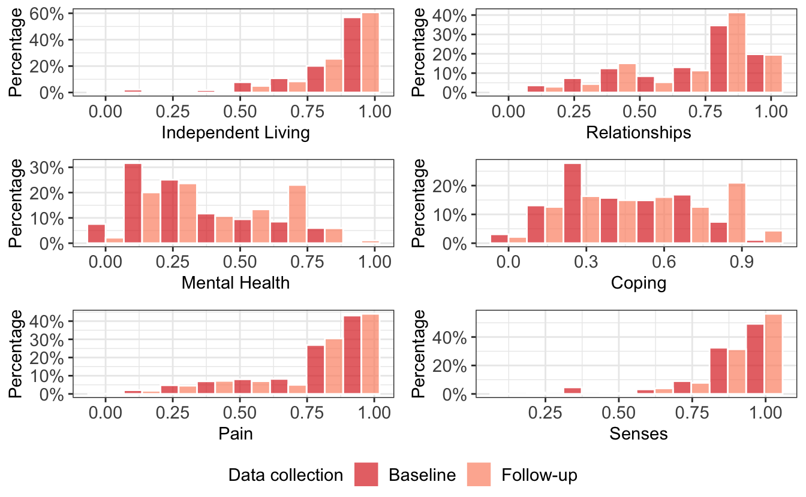

{} This below section renders a vignette article from the TTU library. You can use the following links to:

-   [view the vignette on the library website (adds useful hyperlinks to code blocks)](https://ready4-dev.github.io/TTU/articles/V_01.html)
-   [view the source file](https://github.com/ready4-dev/TTU/blob/main/vignettes/V_01.Rmd) from that article, and;
-   [edit its contents](https://github.com/ready4-dev/TTU/edit/main/vignettes/V_01.Rmd) (requires a GitHub account). {}

Note: **This vignette uses fake data** - it is for illustrative purposes only and should not be used to inform decision making.

## Motivation

Youth mental health services do not typically collect health utility data from their clients, which makes it more difficult to place an economic values on outcomes attained in these services. One strategy for addressing this gap is to use data from similar samples of young people that contain both health utility and the types of outcome measures that are collected in clinical services. The TTU package provides a toolkit for conducting and reporting a utility mapping (or Transfer to Utility) study.

## Implementation

TTU has been developed for use with the [ready4 model](https://ready4-dev.github.io/ready4/) and combines and extends multiple types of [ready4 modules](https://ready4-dev.github.io/ready4/articles/V_01.html):

-   Modules for labeling, validating and summarising youth mental health datasets from the [youthvars](https://ready4-dev.github.io/youthvars/) package;
-   Modules for scoring health utility from the [scorz](https://ready4-dev.github.io/scorz/) package;
-   Modules for specifying and testing statistical models from the [specific](https://ready4-dev.github.io/specific/) package;
-   Modules for generating reports from the [ready4show](https://ready4-dev.github.io/ready4show/) package; and
-   Modules for sharing data via online data repositories from the [ready4use](https://ready4-dev.github.io/ready4use/) package.

Additionally, TTU relies on two RMarkdown programs:

-   ttu_mdl_ctlg: Generate a Template Utility Mapping (Transfer to Utility) Model Catalogue (<https://doi.org/10.5281/zenodo.5936870>)
-   ttu_lng_ss: Create a Draft Scientific Manuscript For A Utility Mapping Study (<https://doi.org/10.5281/zenodo.5976987>)

## Workflow

### Background and citation

The following workflow illustrates (**using fake data**) the same steps we used in a real world study, a summary of which is available at <https://doi.org/10.1101/2021.07.07.21260129>). Citation information for that study is:

<pre class='chroma'><code class='language-r' data-lang='r'>@article {Hamilton2021.07.07.21260129,
    author = {Hamilton, Matthew P and Gao, Caroline X and Filia, Kate M and Menssink, Jana M and Sharmin, Sonia and Telford, Nic and Herrman, Helen and Hickie, Ian B and Mihalopoulos, Cathrine and Rickwood, Debra J and McGorry, Patrick D and Cotton, Sue M},
    title = {Predicting Quality Adjusted Life Years in young people attending primary mental health services},
    elocation-id = {2021.07.07.21260129},
    year = {2021},
    doi = {10.1101/2021.07.07.21260129},
    publisher = {Cold Spring Harbor Laboratory Press},
    URL = {https://www.medrxiv.org/content/early/2021/07/12/2021.07.07.21260129},
    eprint = {https://www.medrxiv.org/content/early/2021/07/12/2021.07.07.21260129.full.pdf},
    journal = {medRxiv}
}
</code></pre>

The program applied in that study, which this workflow closely resembles is available at <https://doi.org/10.5281/zenodo.6116077> and can be cited as follows:

<pre class='chroma'><code class='language-r' data-lang='r'>@software{hamilton_matthew_2022_6212704,
  author       = {Hamilton, Matthew and
                  Gao, Caroline},
  title        = {{Complete study program to reproduce all steps from 
                   data ingest through to results dissemination for a
                   study to map mental health measures to AQoL-6D
                   health utility}},
  month        = feb,
  year         = 2022,
  note         = {{Matthew Hamilton and Caroline Gao  (2022). 
                   Complete study program to reproduce all steps from
                   data ingest through to results dissemination for a
                   study to map mental health measures to AQoL-6D
                   health utility. Zenodo.
                   https://doi.org/10.5281/zenodo.6116077. Version
                   0.0.9.3}},
  publisher    = {Zenodo},
  version      = {0.0.9.3},
  doi          = {10.5281/zenodo.6212704},
  url          = {https://doi.org/10.5281/zenodo.6212704}
}
</code></pre>

### Load required packages

We begin by loading our required packages.

<pre class='chroma'><code class='language-r' data-lang='r'><a href='https://rdrr.io/r/base/library.html'>library</a>(<a href='https://ready4-dev.github.io/ready4/'>ready4</a>)
<a href='https://rdrr.io/r/base/library.html'>library</a>(<a href='https://ready4-dev.github.io/ready4use/'>ready4use</a>)
<a href='https://rdrr.io/r/base/library.html'>library</a>(<a href='https://ready4-dev.github.io/youthvars/'>youthvars</a>)
<a href='https://rdrr.io/r/base/library.html'>library</a>(<a href='https://ready4-dev.github.io/scorz/'>scorz</a>)
<a href='https://rdrr.io/r/base/library.html'>library</a>(<a href='https://ready4-dev.github.io/TTU/'>TTU</a>)</code></pre>

### Add dataset metadata

We use the Ready4useDyad and Ready4useRepos modules to [retrieve and ingest](https://ready4-dev.github.io/ready4use/articles/V_01.html) and to then [pair a dataset and its data dictionary](_https://ready4-dev.github.io/ready4use/articles/V_02.html).

<pre class='chroma'><code class='language-r' data-lang='r'>A &lt;- <a href='https://ready4-dev.github.io/ready4use/reference/Ready4useDyad-class.html'>Ready4useDyad</a>(ds_tb = <a href='https://ready4-dev.github.io/ready4use/reference/Ready4useRepos-class.html'>Ready4useRepos</a>(dv_nm_1L_chr = "fakes",
                                          dv_ds_nm_1L_chr = "https://doi.org/10.7910/DVN/HJXYKQ",
                                          dv_server_1L_chr = "dataverse.harvard.edu") <a href='https://magrittr.tidyverse.org/reference/pipe.html'>%&gt;%</a>
                     <a href='https://ready4-dev.github.io/ready4/reference/ingest-methods.html'>ingest</a>(fls_to_ingest_chr = <a href='https://rdrr.io/r/base/c.html'>c</a>("ymh_clinical_tb"),
                            metadata_1L_lgl = F) <a href='https://magrittr.tidyverse.org/reference/pipe.html'>%&gt;%</a>
                     youthvars::<a href='https://ready4-dev.github.io/youthvars/reference/transform_raw_ds_for_analysis.html'>transform_raw_ds_for_analysis</a>(),
                   dictionary_r3 = <a href='https://ready4-dev.github.io/ready4use/reference/Ready4useRepos-class.html'>Ready4useRepos</a>(dv_nm_1L_chr = "TTU", 
                                                  dv_ds_nm_1L_chr = "https://doi.org/10.7910/DVN/DKDIB0", 
                                                  dv_server_1L_chr = "dataverse.harvard.edu") <a href='https://magrittr.tidyverse.org/reference/pipe.html'>%&gt;%</a>
                     <a href='https://ready4-dev.github.io/ready4/reference/ingest-methods.html'>ingest</a>(fls_to_ingest_chr = <a href='https://rdrr.io/r/base/c.html'>c</a>("dictionary_r3"),
                            metadata_1L_lgl = F)) <a href='https://magrittr.tidyverse.org/reference/pipe.html'>%&gt;%</a>
  <a href='https://ready4-dev.github.io/ready4/reference/renew-methods.html'>renew</a>(type_1L_chr = "label")</code></pre>

We use the YouthvarsSeries module to [supply metadata about out a longitudinal dataset vignette](https://ready4-dev.github.io/youthvars/articles/V_02.html).

<pre class='chroma'><code class='language-r' data-lang='r'>A &lt;- <a href='https://ready4-dev.github.io/youthvars/reference/YouthvarsSeries-class.html'>YouthvarsSeries</a>(a_Ready4useDyad = A,
                     id_var_nm_1L_chr = "fkClientID",
                     timepoint_var_nm_1L_chr = "round",
                     timepoint_vals_chr = <a href='https://rdrr.io/r/base/levels.html'>levels</a>(<a href='https://ready4-dev.github.io/ready4/reference/procureSlot-methods.html'>procureSlot</a>(A,
                                                             "ds_tb")$round))</code></pre>

### Score health utility

We next use the ScorzAqol6Adol module to [score adolescent AQoL-6D health utility](https://ready4-dev.github.io/scorz/articles/V_01.html).

<pre class='chroma'><code class='language-r' data-lang='r'>A &lt;- <a href='https://ready4-dev.github.io/TTU/reference/TTUProject-class.html'>TTUProject</a>(a_ScorzProfile = <a href='https://ready4-dev.github.io/scorz/reference/ScorzAqol6Adol-class.html'>ScorzAqol6Adol</a>(a_YouthvarsProfile = A))
A &lt;- <a href='https://ready4-dev.github.io/ready4/reference/renewSlot-methods.html'>renewSlot</a>(A, "a_ScorzProfile")
#&gt; Joining, by = c("fkClientID", "match_var_chr")</code></pre>

### Evaluate candidate models

Over the next few steps we will use modules from the specific package to to [specify and assess a number of candidate utility mapping models](https://ready4-dev.github.io/specific/articles/V_01.html).

<pre class='chroma'><code class='language-r' data-lang='r'>A &lt;- <a href='https://ready4-dev.github.io/ready4/reference/renewSlot-methods.html'>renewSlot</a>(A, "b_SpecificParameters", <a href='https://ready4-dev.github.io/specific/reference/SpecificConverter-class.html'>SpecificConverter</a>(a_ScorzProfile = A@a_ScorzProfile) <a href='https://magrittr.tidyverse.org/reference/pipe.html'>%&gt;%</a>
                 <a href='https://ready4-dev.github.io/ready4/reference/metamorphose-methods.html'>metamorphose</a>() <a href='https://magrittr.tidyverse.org/reference/pipe.html'>%&gt;%</a>
                 <a href='https://ready4-dev.github.io/ready4/reference/procureSlot-methods.html'>procureSlot</a>("b_SpecificParameters"))</code></pre>

<pre class='chroma'><code class='language-r' data-lang='r'>A &lt;- <a href='https://ready4-dev.github.io/ready4/reference/renewSlot-methods.html'>renewSlot</a>(A, "b_SpecificParameters@predictors_lup", <a href='https://ready4-dev.github.io/ready4use/reference/Ready4useRepos-class.html'>Ready4useRepos</a>(dv_nm_1L_chr = "TTU", 
                                                                        dv_ds_nm_1L_chr = "https://doi.org/10.7910/DVN/DKDIB0", 
                                                                        dv_server_1L_chr = "dataverse.harvard.edu") <a href='https://magrittr.tidyverse.org/reference/pipe.html'>%&gt;%</a>
                 <a href='https://ready4-dev.github.io/ready4/reference/ingest-methods.html'>ingest</a>(fls_to_ingest_chr = <a href='https://rdrr.io/r/base/c.html'>c</a>("predictors_r3"),
                        metadata_1L_lgl = F)) </code></pre>

We can inspect the metadata on candidate predictors that we have just ingested.

<pre class='chroma'><code class='language-r' data-lang='r'><a href='https://ready4-dev.github.io/ready4/reference/exhibitSlot-methods.html'>exhibitSlot</a>(A, "b_SpecificParameters@predictors_lup",
         scroll_box_args_ls = <a href='https://rdrr.io/r/base/list.html'>list</a>(width = "100%"))
</code></pre>

<table class=" lightable-paper lightable-hover lightable-paper" style="font-family: &quot;Arial Narrow&quot;, arial, helvetica, sans-serif; width: auto !important; margin-left: auto; margin-right: auto;border-bottom: 0; font-family: &quot;Arial Narrow&quot;, arial, helvetica, sans-serif; margin-left: auto; margin-right: auto;">
<thead>
<tr>
<th style="text-align:left;">
Variable
</th>
<th style="text-align:right;">
Description
</th>
<th style="text-align:right;">
Minimum
</th>
<th style="text-align:right;">
Maximum
</th>
<th style="text-align:right;">
Class
</th>
<th style="text-align:right;">
Increment
</th>
<th style="text-align:right;">
Function
</th>
<th style="text-align:left;">
Scaling
</th>
<th style="text-align:right;">
Covariate
</th>
</tr>
</thead>
<tbody>
<tr>
<td style="text-align:left;">
BADS
</td>
<td style="text-align:right;">
BADS total score
</td>
<td style="text-align:right;">
0
</td>
<td style="text-align:right;">
150
</td>
<td style="text-align:right;">
integer
</td>
<td style="text-align:right;">
1
</td>
<td style="text-align:right;">
youthvars::youthvars_bads
</td>
<td style="text-align:left;">
0.01
</td>
<td style="text-align:right;">
FALSE
</td>
</tr>
<tr>
<td style="text-align:left;">
GAD7
</td>
<td style="text-align:right;">
GAD7 total score
</td>
<td style="text-align:right;">
0
</td>
<td style="text-align:right;">
21
</td>
<td style="text-align:right;">
integer
</td>
<td style="text-align:right;">
1
</td>
<td style="text-align:right;">
youthvars::youthvars_gad7
</td>
<td style="text-align:left;">
0.01
</td>
<td style="text-align:right;">
FALSE
</td>
</tr>
<tr>
<td style="text-align:left;">
K6
</td>
<td style="text-align:right;">
K6 total score
</td>
<td style="text-align:right;">
0
</td>
<td style="text-align:right;">
24
</td>
<td style="text-align:right;">
integer
</td>
<td style="text-align:right;">
1
</td>
<td style="text-align:right;">
youthvars::youthvars_k6
</td>
<td style="text-align:left;">
0.01
</td>
<td style="text-align:right;">
FALSE
</td>
</tr>
<tr>
<td style="text-align:left;">
OASIS
</td>
<td style="text-align:right;">
OASIS total score
</td>
<td style="text-align:right;">
0
</td>
<td style="text-align:right;">
20
</td>
<td style="text-align:right;">
integer
</td>
<td style="text-align:right;">
1
</td>
<td style="text-align:right;">
youthvars::youthvars_oasis
</td>
<td style="text-align:left;">
0.01
</td>
<td style="text-align:right;">
FALSE
</td>
</tr>
<tr>
<td style="text-align:left;">
PHQ9
</td>
<td style="text-align:right;">
PHQ9 total score
</td>
<td style="text-align:right;">
0
</td>
<td style="text-align:right;">
27
</td>
<td style="text-align:right;">
integer
</td>
<td style="text-align:right;">
1
</td>
<td style="text-align:right;">
youthvars::youthvars_phq9
</td>
<td style="text-align:left;">
0.01
</td>
<td style="text-align:right;">
FALSE
</td>
</tr>
<tr>
<td style="text-align:left;">
SCARED
</td>
<td style="text-align:right;">
SCARED total score
</td>
<td style="text-align:right;">
0
</td>
<td style="text-align:right;">
82
</td>
<td style="text-align:right;">
integer
</td>
<td style="text-align:right;">
1
</td>
<td style="text-align:right;">
youthvars::youthvars_scared
</td>
<td style="text-align:left;">
0.01
</td>
<td style="text-align:right;">
FALSE
</td>
</tr>
<tr>
<td style="text-align:left;">
SOFAS
</td>
<td style="text-align:right;">
SOFAS total score
</td>
<td style="text-align:right;">
0
</td>
<td style="text-align:right;">
100
</td>
<td style="text-align:right;">
integer
</td>
<td style="text-align:right;">
1
</td>
<td style="text-align:right;">
youthvars::youthvars_sofas
</td>
<td style="text-align:left;">
0.01
</td>
<td style="text-align:right;">
TRUE
</td>
</tr>
</tbody>
<tfoot>
<tr>
<td style="padding: 0; " colspan="100%">

</td>
</tr>
</tfoot>
</table>

We add additional metadata about variables in our dataset that will be used in exploratory modelling.

<pre class='chroma'><code class='language-r' data-lang='r'>A &lt;- <a href='https://ready4-dev.github.io/ready4/reference/renewSlot-methods.html'>renewSlot</a>(A, "b_SpecificParameters@depnt_var_min_max_dbl", <a href='https://rdrr.io/r/base/c.html'>c</a>(0.03,1)) <a href='https://magrittr.tidyverse.org/reference/pipe.html'>%&gt;%</a> # Inherit From TTUAqolAdol
  <a href='https://ready4-dev.github.io/ready4/reference/renewSlot-methods.html'>renewSlot</a>("b_SpecificParameters@candidate_predrs_chr", <a href='https://rdrr.io/r/base/c.html'>c</a>("BADS","GAD7", "K6", "OASIS", "PHQ9", "SCARED")) <a href='https://magrittr.tidyverse.org/reference/pipe.html'>%&gt;%</a>
  <a href='https://ready4-dev.github.io/ready4/reference/renewSlot-methods.html'>renewSlot</a>("b_SpecificParameters@candidate_covars_chr", <a href='https://rdrr.io/r/base/c.html'>c</a>("d_sex_birth_s", "d_age",  "d_sexual_ori_s", 
                                                           "d_studying_working", "c_p_diag_s", "c_clinical_staging_s",
                                                           "SOFAS")) <a href='https://magrittr.tidyverse.org/reference/pipe.html'>%&gt;%</a>
  <a href='https://ready4-dev.github.io/ready4/reference/renewSlot-methods.html'>renewSlot</a>("b_SpecificParameters@descv_var_nms_chr", <a href='https://rdrr.io/r/base/c.html'>c</a>("d_age","Gender","d_relation_s", "d_sexual_ori_s", 
                                                        "Region", "d_studying_working", "c_p_diag_s", 
                                                        "c_clinical_staging_s","SOFAS")) <a href='https://magrittr.tidyverse.org/reference/pipe.html'>%&gt;%</a>
  <a href='https://ready4-dev.github.io/ready4/reference/renewSlot-methods.html'>renewSlot</a>("b_SpecificParameters@msrmnt_date_var_nm_1L_chr", "d_interview_date") </code></pre>

<pre class='chroma'><code class='language-r' data-lang='r'>A &lt;-  <a href='https://ready4-dev.github.io/ready4/reference/renewSlot-methods.html'>renewSlot</a>(A, "b_SpecificParameters@fake_1L_lgl", T) </code></pre>

<pre class='chroma'><code class='language-r' data-lang='r'>A &lt;- <a href='https://ready4-dev.github.io/ready4/reference/renewSlot-methods.html'>renewSlot</a>(A, "c_SpecificProject", <a href='https://ready4-dev.github.io/specific/reference/SpecificModels-class.html'>SpecificModels</a>(a_YouthvarsProfile = A@a_ScorzProfile@a_YouthvarsProfile,
                                                      b_SpecificParameters = A@b_SpecificParameters,
                                                      paths_chr = <a href='https://rdrr.io/r/base/tempfile.html'>tempdir</a>())) </code></pre>

<pre class='chroma'><code class='language-r' data-lang='r'>A &lt;- <a href='https://ready4-dev.github.io/ready4/reference/ratifySlot-methods.html'>ratifySlot</a>(A, "c_SpecificProject")</code></pre>

<pre class='chroma'><code class='language-r' data-lang='r'>A &lt;- <a href='https://ready4-dev.github.io/ready4/reference/renewSlot-methods.html'>renewSlot</a>(A, "c_SpecificProject", 
               <a href='https://ready4-dev.github.io/ready4/reference/authorSlot-methods.html'>authorSlot</a>(A, "c_SpecificProject", what_1L_chr = "workspace"))</code></pre>

We now generate tables and charts that describe our dataset. These are saved in a sub-directory of our output data directory, a copy of which is [available for download](https://github.com/ready4-dev/TTU/releases/download/Documentation_0.0/_Descriptives.zip). One of the plots is also reproduced here.

<pre class='chroma'><code class='language-r' data-lang='r'>A &lt;- <a href='https://ready4-dev.github.io/ready4/reference/renewSlot-methods.html'>renewSlot</a>(A, "c_SpecificProject",
               <a href='https://ready4-dev.github.io/ready4/reference/authorSlot-methods.html'>authorSlot</a>(A, "c_SpecificProject", what_1L_chr = "descriptives",
                          digits_1L_int = 3L))
</code></pre>

We next compare the performance of different model types. This step saves model objects and plots to a sub-directory of our output directory, a copy of which is [available for download](https://github.com/ready4-dev/TTU/releases/download/Documentation_0.0/B_Candidate_Predrs_Cmprsn.zip).

<pre class='chroma'><code class='language-r' data-lang='r'>A &lt;- <a href='https://ready4-dev.github.io/ready4/reference/renewSlot-methods.html'>renewSlot</a>(A, "c_SpecificProject",
               <a href='https://ready4-dev.github.io/ready4/reference/investigateSlot-methods.html'>investigateSlot</a>(A, "c_SpecificProject",
                               depnt_var_max_val_1L_dbl = 0.99,
                               session_ls = <a href='https://rdrr.io/r/utils/sessionInfo.html'>sessionInfo</a>()))</code></pre>

After inspecting the output of the previous command, we can now specify the preferred model types to use from this point onwards.

<pre class='chroma'><code class='language-r' data-lang='r'>A &lt;- <a href='https://ready4-dev.github.io/ready4/reference/renewSlot-methods.html'>renewSlot</a>(A, "c_SpecificProject",
               <a href='https://ready4-dev.github.io/ready4/reference/renew-methods.html'>renew</a>(<a href='https://ready4-dev.github.io/ready4/reference/procureSlot-methods.html'>procureSlot</a>(A, "c_SpecificProject"),
                     new_val_xx = <a href='https://rdrr.io/r/base/c.html'>c</a>("GLM_GSN_LOG", "OLS_CLL"),
                     type_1L_chr = "results",
                     what_1L_chr = "prefd_mdls"))</code></pre>

Next we assess multiple versions of our preferred model type - one single predictor model for each of our candidate predictors and the same models with candidate covariates added. A number of model/plot objects saved to a sub-directory of our output directory, a copy of which is [available for download](https://github.com/ready4-dev/TTU/releases/download/Documentation_0.0/C_Predrs_Sngl_Mdl_Cmprsn.zip).

<pre class='chroma'><code class='language-r' data-lang='r'>A &lt;- <a href='https://ready4-dev.github.io/ready4/reference/renewSlot-methods.html'>renewSlot</a>(A, "c_SpecificProject",
               <a href='https://ready4-dev.github.io/ready4/reference/investigateSlot-methods.html'>investigateSlot</a>(A,"c_SpecificProject"))</code></pre>

After reviewing the output of the previous step, we specify the covariates we wish to add to the models.

<pre class='chroma'><code class='language-r' data-lang='r'>A &lt;- <a href='https://ready4-dev.github.io/ready4/reference/renewSlot-methods.html'>renewSlot</a>(A, "c_SpecificProject",
               <a href='https://ready4-dev.github.io/ready4/reference/renew-methods.html'>renew</a>(<a href='https://ready4-dev.github.io/ready4/reference/procureSlot-methods.html'>procureSlot</a>(A, "c_SpecificProject"),
                     new_val_xx = "SOFAS",
                     type_1L_chr = "results",
                     what_1L_chr = "prefd_covars"))</code></pre>

We now assess the multivariate models. More model/plot objects are saved to a sub-directory of our output directory, a copy of which is [available for download](https://github.com/ready4-dev/TTU/releases/download/Documentation_0.0/E_Predrs_W_Covars_Sngl_Mdl_Cmprsn.zip).

<pre class='chroma'><code class='language-r' data-lang='r'>A &lt;- <a href='https://ready4-dev.github.io/ready4/reference/renewSlot-methods.html'>renewSlot</a>(A, "c_SpecificProject",
               <a href='https://ready4-dev.github.io/ready4/reference/investigateSlot-methods.html'>investigateSlot</a>(A, "c_SpecificProject"))</code></pre>

We next reformulate the models we finalised in the previous step so that they are suitable for modelling longitudinal change.

For our primary analysis, we use the longitudinal formulation of the models we previously selected. A series of large model files are written to the local output data directory.

<pre class='chroma'><code class='language-r' data-lang='r'>A &lt;- <a href='https://ready4-dev.github.io/ready4/reference/renewSlot-methods.html'>renewSlot</a>(A, "c_SpecificProject",
               <a href='https://ready4-dev.github.io/ready4/reference/investigateSlot-methods.html'>investigateSlot</a>(A, "c_SpecificProject"))</code></pre>

For our secondary analyses, we specify alternative combinations of predictors and covariates.

<pre class='chroma'><code class='language-r' data-lang='r'>A &lt;- <a href='https://ready4-dev.github.io/ready4/reference/renewSlot-methods.html'>renewSlot</a>(A, "c_SpecificProject",
               <a href='https://ready4-dev.github.io/ready4/reference/investigateSlot-methods.html'>investigateSlot</a>(A, "c_SpecificProject",
                               scndry_anlys_params_ls = <a href='https://ready4-dev.github.io/specific/reference/make_scndry_anlys_params.html'>make_scndry_anlys_params</a>(candidate_predrs_chr = <a href='https://rdrr.io/r/base/c.html'>c</a>("SOFAS"),
                                                                                 candidate_covar_nms_chr = <a href='https://rdrr.io/r/base/c.html'>c</a>("d_sex_birth_s", 
                                                                                                             "d_age", 
                                                                                                             "d_sexual_ori_s",
                                                                                                             "d_studying_working"),
                                                                                 prefd_covars_chr = NA_character_) <a href='https://magrittr.tidyverse.org/reference/pipe.html'>%&gt;%</a>
                                 <a href='https://ready4-dev.github.io/specific/reference/make_scndry_anlys_params.html'>make_scndry_anlys_params</a>(candidate_predrs_chr = <a href='https://rdrr.io/r/base/c.html'>c</a>("SCARED","OASIS","GAD7"),
                                                          candidate_covar_nms_chr = <a href='https://rdrr.io/r/base/c.html'>c</a>("PHQ9", "SOFAS", 
                                                                                      "d_sex_birth_s", 
                                                                                      "d_age", 
                                                                                      "d_sexual_ori_s",
                                                                                      "d_studying_working"),
                                                          prefd_covars_chr = "PHQ9")))</code></pre>

### Report and disseminate findings

#### Create shareable models

The model objects created and saved in our working directory by the preceding steps are not suitable for public dissemination. They are both too large in file size and, more importantly, include copies of our source dataset. We can overcome these limitations by creating shareable versions of the models. Two types of shareable version are created - copies of the original model objects in which fake data overwrites the original source data and summary tables of model coefficients.

<pre class='chroma'><code class='language-r' data-lang='r'>A &lt;- <a href='https://ready4-dev.github.io/ready4/reference/renewSlot-methods.html'>renewSlot</a>(A, "c_SpecificProject",
               <a href='https://ready4-dev.github.io/ready4/reference/authorData-methods.html'>authorData</a>(<a href='https://ready4-dev.github.io/ready4/reference/procureSlot-methods.html'>procureSlot</a>(A, "c_SpecificProject")))</code></pre>

#### Specify study reporting metadata

We create a `TTUSynopsis` object that contains the fields necessary to render and share reports.

<pre class='chroma'><code class='language-r' data-lang='r'>A &lt;- <a href='https://ready4-dev.github.io/ready4/reference/renewSlot-methods.html'>renewSlot</a>(A, "d_TTUReports",
               &#123;
                 Y &lt;- <a href='https://ready4-dev.github.io/ready4/reference/metamorphoseSlot-methods.html'>metamorphoseSlot</a>(A, "c_SpecificProject")
                 Y &lt;- <a href='https://ready4-dev.github.io/TTU/reference/TTUSynopsis-class.html'>TTUSynopsis</a>(a_Ready4showPaths = Y@a_Ready4showPaths,
                                  b_SpecificResults = Y@b_SpecificResults,
                                  c_SpecificParameters = Y@c_SpecificParameters,
                                  d_YouthvarsProfile = Y@d_YouthvarsProfile,
                                  rmd_fl_nms_ls = Y@rmd_fl_nms_ls)
                 Y &lt;- <a href='https://ready4-dev.github.io/TTU/reference/TTUReports-class.html'>TTUReports</a>(a_TTUSynopsis = Y)
                 Y
                 &#125;
               )</code></pre>

We add metadata relevant to the reports that we will be generating to these fields. Note that the data we supply to the Ready4useRepos object below must relate to a repository to which we have write permissions (otherwise subsequent steps will fail).

<pre class='chroma'><code class='language-r' data-lang='r'>A &lt;- <a href='https://ready4-dev.github.io/ready4/reference/renewSlot-methods.html'>renewSlot</a>(A, "d_TTUReports@a_TTUSynopsis",
               <a href='https://ready4-dev.github.io/ready4/reference/procureSlot-methods.html'>procureSlot</a>(A, "d_TTUReports@a_TTUSynopsis") <a href='https://magrittr.tidyverse.org/reference/pipe.html'>%&gt;%</a> 
                 <a href='https://ready4-dev.github.io/ready4/reference/renewSlot-methods.html'>renewSlot</a>("authors_r3", ready4show::<a href='https://ready4-dev.github.io/ready4show/reference/authors_tb.html'>authors_tb</a>) <a href='https://magrittr.tidyverse.org/reference/pipe.html'>%&gt;%</a>
                 <a href='https://ready4-dev.github.io/ready4/reference/renewSlot-methods.html'>renewSlot</a>("institutes_r3", ready4show::<a href='https://ready4-dev.github.io/ready4show/reference/institutes_tb.html'>institutes_tb</a>) <a href='https://magrittr.tidyverse.org/reference/pipe.html'>%&gt;%</a>
                 <a href='https://ready4-dev.github.io/ready4/reference/renewSlot-methods.html'>renewSlot</a>("digits_int", <a href='https://rdrr.io/r/base/c.html'>c</a>(3L,3L)) <a href='https://magrittr.tidyverse.org/reference/pipe.html'>%&gt;%</a>
                 <a href='https://ready4-dev.github.io/ready4/reference/renewSlot-methods.html'>renewSlot</a>("outp_formats_chr", <a href='https://rdrr.io/r/base/c.html'>c</a>("PDF","PDF")) <a href='https://magrittr.tidyverse.org/reference/pipe.html'>%&gt;%</a>
                 <a href='https://ready4-dev.github.io/ready4/reference/renewSlot-methods.html'>renewSlot</a>("title_1L_chr", "A hypothetical utility mapping study using fake data") <a href='https://magrittr.tidyverse.org/reference/pipe.html'>%&gt;%</a>
                 <a href='https://ready4-dev.github.io/ready4/reference/renewSlot-methods.html'>renewSlot</a>("correspondences_r3", old_nms_chr = <a href='https://rdrr.io/r/base/c.html'>c</a>("PHQ9", "GAD7"), new_nms_chr = <a href='https://rdrr.io/r/base/c.html'>c</a>("PHQ-9", "GAD-7")) <a href='https://magrittr.tidyverse.org/reference/pipe.html'>%&gt;%</a>
                 <a href='https://ready4-dev.github.io/ready4/reference/renewSlot-methods.html'>renewSlot</a>("e_Ready4useRepos", <a href='https://ready4-dev.github.io/ready4use/reference/Ready4useRepos-class.html'>Ready4useRepos</a>(dv_nm_1L_chr = "fakes", 
                                                              dv_ds_nm_1L_chr = "https://doi.org/10.7910/DVN/D74QMP", 
                                                              dv_server_1L_chr = "dataverse.harvard.edu"))) 
</code></pre>

#### Author model catalogues

We download a program for generating a catalogue of models and use it to summarising the models created under each study analysis (one primary and two secondary). The catalogues are saved locally.

<pre class='chroma'><code class='language-r' data-lang='r'><a href='https://ready4-dev.github.io/ready4/reference/authorSlot-methods.html'>authorSlot</a>(A, "d_TTUReports", what_1L_chr = "Catalogue", download_tmpl_1L_lgl = T)</code></pre>

#### Share model catalogue

We share the catalogues that we created, uploading a copy to our study online repository. To run this step you will need write permissions to the online repository.

<pre class='chroma'><code class='language-r' data-lang='r'><a href='https://ready4-dev.github.io/ready4/reference/shareSlot-methods.html'>shareSlot</a>(A, "d_TTUReports@a_TTUSynopsis", type_1L_chr = "Report", what_1L_chr = "Catalogue") </code></pre>

#### Share models

We share tables of coefficients and other meta-data about the models we have created by posting them to the online repository. The object we create and share is designed to be used in conjunction with the `youthu` package to make it easier to make predictions with these models using new data. Again, you will need write permissions to the online repository.

<pre class='chroma'><code class='language-r' data-lang='r'><a href='https://ready4-dev.github.io/ready4/reference/shareSlot-methods.html'>shareSlot</a>(A, "d_TTUReports@a_TTUSynopsis", type_1L_chr = "Models", what_1L_chr = "ingredients")</code></pre>

#### Author manuscript

We add some content about the manuscript we wish to author.

<pre class='chroma'><code class='language-r' data-lang='r'>A &lt;- <a href='https://ready4-dev.github.io/ready4/reference/renewSlot-methods.html'>renewSlot</a>(A, "d_TTUReports@a_TTUSynopsis",
               <a href='https://ready4-dev.github.io/ready4/reference/procureSlot-methods.html'>procureSlot</a>(A, "d_TTUReports@a_TTUSynopsis") <a href='https://magrittr.tidyverse.org/reference/pipe.html'>%&gt;%</a> 
                 <a href='https://ready4-dev.github.io/ready4/reference/renewSlot-methods.html'>renewSlot</a>("background_1L_chr", "Quality Adjusted Life Years (QALYs) are often used in economic evaluations, yet utility weights for deriving them are rarely directly measured in mental health services.") <a href='https://magrittr.tidyverse.org/reference/pipe.html'>%&gt;%</a>
                 <a href='https://ready4-dev.github.io/ready4/reference/renewSlot-methods.html'>renewSlot</a>("coi_1L_chr", "None declared") <a href='https://magrittr.tidyverse.org/reference/pipe.html'>%&gt;%</a>
                 <a href='https://ready4-dev.github.io/ready4/reference/renewSlot-methods.html'>renewSlot</a>("conclusion_1L_chr","Nothing should be concluded from this study as it is purely hypothetical.") <a href='https://magrittr.tidyverse.org/reference/pipe.html'>%&gt;%</a>
                 <a href='https://ready4-dev.github.io/ready4/reference/renewSlot-methods.html'>renewSlot</a>("ethics_1L_chr", "The study was reviewed and granted approval by no-one." ) <a href='https://magrittr.tidyverse.org/reference/pipe.html'>%&gt;%</a>
                 <a href='https://ready4-dev.github.io/ready4/reference/renewSlot-methods.html'>renewSlot</a>("funding_1L_chr", "The study was funded by no-one.") <a href='https://magrittr.tidyverse.org/reference/pipe.html'>%&gt;%</a>
                 <a href='https://ready4-dev.github.io/ready4/reference/renewSlot-methods.html'>renewSlot</a>("interval_chr", "three months") <a href='https://magrittr.tidyverse.org/reference/pipe.html'>%&gt;%</a>
                 <a href='https://ready4-dev.github.io/ready4/reference/renewSlot-methods.html'>renewSlot</a>("keywords_chr", <a href='https://rdrr.io/r/base/c.html'>c</a>("anxiety", "AQoL","depression", "psychological distress", "QALYs", "utility mapping")) <a href='https://magrittr.tidyverse.org/reference/pipe.html'>%&gt;%</a>
                 <a href='https://ready4-dev.github.io/ready4/reference/renewSlot-methods.html'>renewSlot</a>("sample_desc_1L_chr", "The study sample is fake data.") )</code></pre>

We create a summary of results that can be interpreted by the program that authors the manuscript.

<pre class='chroma'><code class='language-r' data-lang='r'>A &lt;- <a href='https://ready4-dev.github.io/ready4/reference/renewSlot-methods.html'>renewSlot</a>(A, "d_TTUReports@a_TTUSynopsis@abstract_args_ls",
               <a href='https://ready4-dev.github.io/ready4/reference/manufactureSlot-methods.html'>manufactureSlot</a>(A,"d_TTUReports@a_TTUSynopsis", what_1L_chr = "abstract_args_ls",
                               depnt_var_nms_chr = <a href='https://rdrr.io/r/base/c.html'>c</a>("AQoL-6D", "Adolescent AQoL Six Dimension"))) </code></pre>

<pre class='chroma'><code class='language-r' data-lang='r'>A &lt;- <a href='https://ready4-dev.github.io/ready4/reference/enhanceSlot-methods.html'>enhanceSlot</a>(A, "d_TTUReports@a_TTUSynopsis", with_1L_chr = "results_ls",
                 depnt_var_nms_chr = <a href='https://rdrr.io/r/base/c.html'>c</a>("AQoL-6D", "Adolescent AQoL Six Dimension")) </code></pre>

We create and save the plots that will be used in the manuscript.

<pre class='chroma'><code class='language-r' data-lang='r'><a href='https://ready4-dev.github.io/ready4/reference/authorSlot-methods.html'>authorSlot</a>(A, "d_TTUReports", type_1L_chr = "Plots",
           depnt_var_desc_1L_chr = A@d_TTUReports@a_TTUSynopsis@b_SpecificResults@a_SpecificShareable@shareable_outp_ls$results_ls$study_descs_ls$health_utl_nm_1L_chr)</code></pre>

We download a program for generating a template manuscript and run it to author a first draft of the manuscript.

<pre class='chroma'><code class='language-r' data-lang='r'><a href='https://ready4-dev.github.io/ready4/reference/authorSlot-methods.html'>authorSlot</a>(A, "d_TTUReports", type_1L_chr = "Report", what_1L_chr = "Manuscript_Auto", download_tmpl_1L_lgl = T)</code></pre>

We can copy the RMarkdown files that created the template manuscript to a new director (which we call "Manuscript_Submission") so that we can then manually edit those files to produce a manuscript that we can submit for publication. Note that in this example we have not made any edits to the template manuscript.

<pre class='chroma'><code class='language-r' data-lang='r'>R.utils::<a href='https://henrikbengtsson.github.io/R.utils/reference/copyDirectory.html'>copyDirectory</a>(<a href='https://rdrr.io/r/base/paste.html'>paste0</a>(A@d_TTUReports@a_TTUSynopsis@a_Ready4showPaths@outp_data_dir_1L_chr,
                              "/",
                              A@d_TTUReports@a_TTUSynopsis@a_Ready4showPaths@mkdn_data_dir_1L_chr,
                              "/Manuscript_Auto"),
                       <a href='https://rdrr.io/r/base/paste.html'>paste0</a>(A@d_TTUReports@a_TTUSynopsis@a_Ready4showPaths@outp_data_dir_1L_chr,
                              "/",
                              A@d_TTUReports@a_TTUSynopsis@a_Ready4showPaths@mkdn_data_dir_1L_chr,
                              "/Manuscript_Submission"))</code></pre>

Once any edits to the RMarkdown files for creating the submission manuscript have been finalised, we can run the following command to author the manuscript. The below commands will generate a Microsoft Word format manuscript and a PDF technical appendix. Unlike the template manuscript, the figures and tables are positioned after (and not within) the main body of the manuscript. Note that the Word version of the manuscript generated by these commands will require some minor formatting edits (principally to the display of tables and numbering of sections).

<pre class='chroma'><code class='language-r' data-lang='r'>A &lt;- <a href='https://ready4-dev.github.io/ready4/reference/renewSlot-methods.html'>renewSlot</a>(A, "d_TTUReports",
               <a href='https://ready4-dev.github.io/ready4/reference/procureSlot-methods.html'>procureSlot</a>(A, "d_TTUReports") <a href='https://magrittr.tidyverse.org/reference/pipe.html'>%&gt;%</a>
                 <a href='https://ready4-dev.github.io/ready4/reference/renewSlot-methods.html'>renewSlot</a>("a_TTUSynopsis@tables_in_body_lgl",  F) <a href='https://magrittr.tidyverse.org/reference/pipe.html'>%&gt;%</a>
                 <a href='https://ready4-dev.github.io/ready4/reference/renewSlot-methods.html'>renewSlot</a>("a_TTUSynopsis@figures_in_body_lgl", F) <a href='https://magrittr.tidyverse.org/reference/pipe.html'>%&gt;%</a>
                 <a href='https://ready4-dev.github.io/ready4/reference/renewSlot-methods.html'>renewSlot</a>("a_TTUSynopsis@outp_formats_chr", <a href='https://rdrr.io/r/base/c.html'>c</a>("Word","PDF")))
<a href='https://ready4-dev.github.io/ready4/reference/authorSlot-methods.html'>authorSlot</a>(A, "d_TTUReports", what_1L_chr = "Manuscript_Submission", download_tmpl_1L_lgl = F)</code></pre>

### Tidy workspace

The preceding steps saved multiple objects (mostly R model objects) that have embedded within them copies of the source dataset. We can now purge all such copies from our output data directory.

<pre class='chroma'><code class='language-r' data-lang='r'><a href='https://ready4-dev.github.io/ready4/reference/author-methods.html'>author</a>(<a href='https://ready4-dev.github.io/ready4/reference/procureSlot-methods.html'>procureSlot</a>(A,"c_SpecificProject"),
       type_1L_chr = "purge_write") </code></pre>

