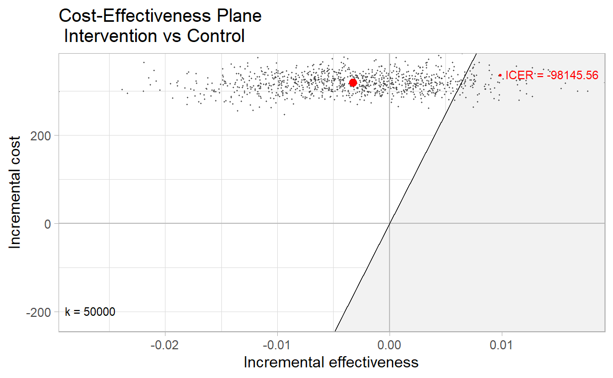

{} This below section renders a vignette article from the youthu library. You can use the following links to:

-   [view the vignette on the library website (adds useful hyperlinks to code blocks)](https://ready4-dev.github.io/youthu/articles/Economic_Analysis.html)
-   [view the source file](https://github.com/ready4-dev/youthu/blob/main/vignettes/Economic_Analysis.Rmd) from that article, and;
-   [edit its contents](https://github.com/ready4-dev/youthu/edit/main/vignettes/Economic_Analysis.Rmd) (requires a GitHub account). {}

<pre class='chroma'><code class='language-r' data-lang='r'><a href='https://rdrr.io/r/base/library.html'>library</a>(<a href='https://ready4-dev.github.io/youthu/'>youthu</a>)
<a href='https://rdrr.io/r/base/library.html'>library</a>(<a href='https://ggplot2.tidyverse.org'>ggplot2</a>)
<a href='https://rdrr.io/r/base/library.html'>library</a>(<a href='https://ready4-dev.github.io/ready4use/'>ready4use</a>)
<a href='https://rdrr.io/r/base/Random.html'>set.seed</a>(1234)</code></pre>

This vignette illustrates the rationale for and practical decision-making utility of youthu's [QALYs prediction workflow](https://ready4-dev.github.io/youthu/articles/Prediction_With_Mdls.html). Note, this example is illustrated with fake data and should not be used to inform decision-making.

## Motivation

The main motivation behind the youthu package is to extend the types of economic analysis that can be undertaken with both single group (e.g. pilot study, health service records) and matched groups (e.g. trial) longitudinal datasets that do not include measures of health utility. This article focuses on its application to matched group datasets.

## Example dataset

First, we must first import our data. In this example we will use a fake dataset.

<pre class='chroma'><code class='language-r' data-lang='r'>ds_tb &lt;- <a href='https://ready4-dev.github.io/youthu/reference/make_fake_ds_two.html'>make_fake_ds_two</a>()
#&gt; Joining with `by = join_by(fkClientID, study_arm_chr)`
</code></pre>

Our dataset includes 268 matched comparisons, with each comparison containing baseline and follow-up records for one intervention arm participant and one control arm participant. The first few records are as follows.

<table class=" lightable-paper lightable-hover lightable-paper" style="color: black; font-family: &quot;Arial Narrow&quot;, arial, helvetica, sans-serif; width: auto !important; margin-left: auto; margin-right: auto;border-bottom: 0; color: black; font-family: &quot;Arial Narrow&quot;, arial, helvetica, sans-serif; margin-left: auto; margin-right: auto;">
<caption>
First few records from input dataset
</caption>
<thead>
<tr>
<th style="text-align:left;">
fkClientID
</th>
<th style="text-align:right;">
round
</th>
<th style="text-align:right;">
date_psx
</th>
<th style="text-align:right;">
duration_prd
</th>
<th style="text-align:right;">
PHQ9
</th>
<th style="text-align:right;">
SOFAS
</th>
<th style="text-align:left;">
costs_dbl
</th>
<th style="text-align:right;">
study_arm_chr
</th>
<th style="text-align:right;">
match_idx_int
</th>
</tr>
</thead>
<tbody>
<tr>
<td style="text-align:left;">
Participant_20
</td>
<td style="text-align:right;">
Baseline
</td>
<td style="text-align:right;">
2023-07-04
</td>
<td style="text-align:right;">
0S
</td>
<td style="text-align:right;">
16
</td>
<td style="text-align:right;">
41
</td>
<td style="text-align:left;">
301.1868
</td>
<td style="text-align:right;">
Intervention
</td>
<td style="text-align:right;">
1
</td>
</tr>
<tr>
<td style="text-align:left;">
Participant_593
</td>
<td style="text-align:right;">
Baseline
</td>
<td style="text-align:right;">
2023-05-11
</td>
<td style="text-align:right;">
0S
</td>
<td style="text-align:right;">
19
</td>
<td style="text-align:right;">
43
</td>
<td style="text-align:left;">
259.3190
</td>
<td style="text-align:right;">
Control
</td>
<td style="text-align:right;">
1
</td>
</tr>
<tr>
<td style="text-align:left;">
Participant_593
</td>
<td style="text-align:right;">
Follow-up
</td>
<td style="text-align:right;">
2023-11-02
</td>
<td style="text-align:right;">
175d 0H 0M 0S
</td>
<td style="text-align:right;">
16
</td>
<td style="text-align:right;">
65
</td>
<td style="text-align:left;">
1290.4220
</td>
<td style="text-align:right;">
Control
</td>
<td style="text-align:right;">
1
</td>
</tr>
<tr>
<td style="text-align:left;">
Participant_20
</td>
<td style="text-align:right;">
Follow-up
</td>
<td style="text-align:right;">
2023-12-29
</td>
<td style="text-align:right;">
178d 0H 0M 0S
</td>
<td style="text-align:right;">
15
</td>
<td style="text-align:right;">
74
</td>
<td style="text-align:left;">
1787.4242
</td>
<td style="text-align:right;">
Intervention
</td>
<td style="text-align:right;">
1
</td>
</tr>
<tr>
<td style="text-align:left;">
Participant_259
</td>
<td style="text-align:right;">
Baseline
</td>
<td style="text-align:right;">
2023-08-29
</td>
<td style="text-align:right;">
0S
</td>
<td style="text-align:right;">
19
</td>
<td style="text-align:right;">
39
</td>
<td style="text-align:left;">
311.0018
</td>
<td style="text-align:right;">
Control
</td>
<td style="text-align:right;">
2
</td>
</tr>
<tr>
<td style="text-align:left;">
Participant_962
</td>
<td style="text-align:right;">
Baseline
</td>
<td style="text-align:right;">
2023-10-11
</td>
<td style="text-align:right;">
0S
</td>
<td style="text-align:right;">
10
</td>
<td style="text-align:right;">
45
</td>
<td style="text-align:left;">
276.2181
</td>
<td style="text-align:right;">
Intervention
</td>
<td style="text-align:right;">
2
</td>
</tr>
</tbody>
<tfoot>
<tr>
<td style="padding: 0; " colspan="100%">

</td>
</tr>
</tfoot>
</table>

This dataset contains features that make it possible to use in conjunction with youthu's economic analysis functions. These requirements are described in the vignette about [finding and using models compatible models to predict QALYs](https://ready4-dev.github.io/youthu/articles/Prediction_With_Mdls.html);

The dataset also contains a cost variable, which is a requirement for most, though not all, of the economic analyses that can be undertaken with youthu.

## Limitations of datasets without measures of health utility

A notable omission from the dataset is any measure of utility. This omission means that, in the absence of using mapping algorithms such as those included with youthu, the most feasible types of economic evaluation to apply to this dataset would likely be cost-consequence analysis (where a synopsis of the differences in a range of measures are presented alongside cost differences) and cost-effectiveness analysis (where a summary statistic - the incremental cost-effectiveness ratio or ICER - is calculated by dividing differences in costs by differences in a single outcome measure).

These types of economic analyses can be relatively simple to interpret if either the intervention or control arm is simultaneously cheaper and more effective across all included outcome measures. However, these conditions don't hold in our sample data.

<pre class='chroma'><code class='language-r' data-lang='r'><a href='https://rdrr.io/r/base/summary.html'>summary</a>((ds_tb <a href='https://magrittr.tidyverse.org/reference/pipe.html'>%&gt;%</a> dplyr::<a href='https://dplyr.tidyverse.org/reference/filter.html'>filter</a>(study_arm_chr == "Control" &amp; round == "Baseline"))[5:6])
#&gt;       PHQ9          SOFAS      
#&gt;  Min.   : 0.0   Min.   :39.00  
#&gt;  1st Qu.: 7.0   1st Qu.:60.00  
#&gt;  Median :12.0   Median :66.00  
#&gt;  Mean   :10.9   Mean   :66.13  
#&gt;  3rd Qu.:15.0   3rd Qu.:72.00  
#&gt;  Max.   :19.0   Max.   :89.00
</code></pre>

<pre class='chroma'><code class='language-r' data-lang='r'><a href='https://rdrr.io/r/base/summary.html'>summary</a>((ds_tb <a href='https://magrittr.tidyverse.org/reference/pipe.html'>%&gt;%</a> dplyr::<a href='https://dplyr.tidyverse.org/reference/filter.html'>filter</a>(study_arm_chr == "Control" &amp; round == "Follow-up"))[5:7])
#&gt;       PHQ9            SOFAS         costs_dbl     
#&gt;  Min.   : 0.000   Min.   :39.00   Min.   : 889.9  
#&gt;  1st Qu.: 4.000   1st Qu.:64.00   1st Qu.:1321.1  
#&gt;  Median : 8.000   Median :71.00   Median :1486.7  
#&gt;  Mean   : 8.493   Mean   :70.65   Mean   :1489.0  
#&gt;  3rd Qu.:13.000   3rd Qu.:77.00   3rd Qu.:1627.0  
#&gt;  Max.   :27.000   Max.   :98.00   Max.   :2216.5
</code></pre>

<pre class='chroma'><code class='language-r' data-lang='r'><a href='https://rdrr.io/r/base/summary.html'>summary</a>((ds_tb <a href='https://magrittr.tidyverse.org/reference/pipe.html'>%&gt;%</a> dplyr::<a href='https://dplyr.tidyverse.org/reference/filter.html'>filter</a>(study_arm_chr == "Intervention" &amp; round == "Baseline"))[5:6])
#&gt;       PHQ9           SOFAS      
#&gt;  Min.   : 0.00   Min.   :36.00  
#&gt;  1st Qu.: 7.00   1st Qu.:61.00  
#&gt;  Median :11.00   Median :67.00  
#&gt;  Mean   :10.81   Mean   :66.74  
#&gt;  3rd Qu.:15.00   3rd Qu.:72.25  
#&gt;  Max.   :19.00   Max.   :88.00
</code></pre>

<pre class='chroma'><code class='language-r' data-lang='r'><a href='https://rdrr.io/r/base/summary.html'>summary</a>((ds_tb <a href='https://magrittr.tidyverse.org/reference/pipe.html'>%&gt;%</a> dplyr::<a href='https://dplyr.tidyverse.org/reference/filter.html'>filter</a>(study_arm_chr == "Intervention" &amp; round == "Follow-up"))[5:7])
#&gt;       PHQ9            SOFAS      costs_dbl     
#&gt;  Min.   : 0.000   Min.   :40   Min.   : 923.4  
#&gt;  1st Qu.: 2.000   1st Qu.:60   1st Qu.:1625.6  
#&gt;  Median : 6.500   Median :68   Median :1777.3  
#&gt;  Mean   : 6.851   Mean   :68   Mean   :1807.8  
#&gt;  3rd Qu.:11.000   3rd Qu.:77   3rd Qu.:1996.0  
#&gt;  Max.   :25.000   Max.   :93   Max.   :2872.7
</code></pre>

The pattern of results summarised above create some significant barriers to meaningfully interpreting economic evaluations that are based on cost-consequence or cost-effectiveness analysis:

-   A cost-effectiveness analysis in which change in PHQ-9 was the benefit measure would be difficult to interpret as the Intervention arm is both more effective and more costly, which begs the question is it worth paying the extra dollars for this improvement? Also - would a judgment of cost-effectiveness remain the same if the study had measured a slightly different incremental benefit or recorded change over a longer or shorter time horizon? It is likely that there is no commonly used value for money benchmark for improvements measured in PHQ-9, nor is there any time weighting associated with the measure. Furthermore, if the potential funding for the intervention is from a budget that is allocated to non-depressive illnesses (e.g. physical health), results from a cost-effectiveness analysis using PHQ-9 as its benefit measure are not readily comparable with economic evaluations of interventions from other illness groups using different benefit measures that are potentially competing for the same scarce funding.

-   A cost consequence analyses that summarised the differences in costs with the differences in changes in PHQ-9 and SOFAS score would be difficult to interpret because while the intervention is more effective than control for improvements measured on PHQ-9 (where lower scores are better), the control group is superior if benefits are based on functioning improvements as measured by SOFAS scores (where higher scores are better). The lack of any formal weighting for how to trade off clinical symptoms and functioning means that interpretation of this analysis will be highly subjective and likely to change across potential decision makers.

These types of short-comings can be significantly addressed by undertaking cost-utility analyses (CUAs) as:

-   they use a measure of benefit - the Quality Adjusted Life Year (QALY) - that captures multiple domains of health, weighted by time and population preferences in a single index measure that can be applied across health conditions;
-   there are published benchmark willingness to pay values for QALYs that are routinely used by decision makers in many countries to make ICER statistics readily interpretable in the context of health budget allocation.

The rest of this article demonstrates how youthu functions can be used to undertake CUA based analyses on the type of data we have just profiled.

## Using youthu in a cost-utility analysis workflow

### Predict adolescent AQoL-6D health utility

Our first step is to identify which youthu models we will use to predict adolescent AQoL-6D and apply these models to our data. This step was explained in more detail in [another vignette article about finding and using transfer to utility models](https://ready4-dev.github.io/youthu/articles/Prediction_With_Mdls.html), so will be dealt with briefly here.

We ingest metadata about the mapping models we plan to use. **NOTE: This is a temporary step that is required due to the metadata file not being in the study online repository. This code will cease to work once the metadata file has been moved from its temporary location to the study dataset. We will perform this task when an associated manuscript exits its current review process.**

<pre class='chroma'><code class='language-r' data-lang='r'>mdl_meta_data_ls &lt;- <a href='https://ready4-dev.github.io/ready4/reference/ingest-methods.html'>ingest</a>(<a href='https://ready4-dev.github.io/ready4use/reference/Ready4useRepos-class.html'>Ready4useRepos</a>(gh_repo_1L_chr = "ready4-dev/youthu", gh_tag_1L_chr = "v0.0.0.91125"), fls_to_ingest_chr = <a href='https://rdrr.io/r/base/c.html'>c</a>("mdl_meta_data_ls"), metadata_1L_lgl = F)</code></pre>

We now make sure that our dataset can be used as a prediction dataset in conjunction with the model we intend using.

<pre class='chroma'><code class='language-r' data-lang='r'>predn_ds_ls &lt;- <a href='https://ready4-dev.github.io/youthu/reference/make_predn_metadata_ls.html'>make_predn_metadata_ls</a>(ds_tb,
                                      cmprsn_groups_chr = <a href='https://rdrr.io/r/base/c.html'>c</a>("Intervention", "Control"),
                                      cmprsn_var_nm_1L_chr = "study_arm_chr",
                                      costs_var_nm_1L_chr = "costs_dbl",
                                      id_var_nm_1L_chr = "fkClientID",
                                      mdl_meta_data_ls = mdl_meta_data_ls,
                                      msrmnt_date_var_nm_1L_chr = "date_psx",
                                      round_var_nm_1L_chr = "round",
                                      round_bl_val_1L_chr = "Baseline",
                                      utl_var_nm_1L_chr = "AQoL6D_HU",
                                      mdls_lup = <a href='https://ready4-dev.github.io/youthu/reference/get_mdls_lup.html'>get_mdls_lup</a>(utility_type_chr = "AQoL-6D",
                                                              mdl_predrs_in_ds_chr = <a href='https://rdrr.io/r/base/c.html'>c</a>("PHQ9 total score",
                                                                                       "SOFAS total score"),
                                                              ttu_dv_nms_chr = "TTU"),
                                      mdl_nm_1L_chr =  "PHQ9_SOFAS_1_OLS_CLL")</code></pre>

We now use our preferred model to predict health utility from the measures in our dataset.

<pre class='chroma'><code class='language-r' data-lang='r'>ds_tb &lt;- <a href='https://ready4-dev.github.io/youthu/reference/add_utl_predn.html'>add_utl_predn</a>(ds_tb,
                       predn_ds_ls = predn_ds_ls) <a href='https://magrittr.tidyverse.org/reference/pipe.html'>%&gt;%</a>
  dplyr::<a href='https://dplyr.tidyverse.org/reference/select.html'>select</a>(fkClientID, round, study_arm_chr, date_psx, duration_prd, dplyr::<a href='https://tidyselect.r-lib.org/reference/everything.html'>everything</a>())
#&gt; Joining with `by = join_by(fkClientID, round)`
</code></pre>

### Calculate QALYs

Next we combine the health utility data with the interval between measurement data to calculate QALYs and add them to the dataset.

<pre class='chroma'><code class='language-r' data-lang='r'>ds_tb  &lt;- ds_tb <a href='https://magrittr.tidyverse.org/reference/pipe.html'>%&gt;%</a> <a href='https://ready4-dev.github.io/youthu/reference/add_qalys_to_ds.html'>add_qalys_to_ds</a>(predn_ds_ls = predn_ds_ls,
                                    include_predrs_1L_lgl = T,
                                    reshape_1L_lgl = T)</code></pre>

<table class=" lightable-paper lightable-hover lightable-paper" style="color: black; font-family: &quot;Arial Narrow&quot;, arial, helvetica, sans-serif; width: auto !important; margin-left: auto; margin-right: auto;border-bottom: 0; color: black; font-family: &quot;Arial Narrow&quot;, arial, helvetica, sans-serif; margin-left: auto; margin-right: auto;">
<caption>
First few records from updated dataset with QALYs
</caption>
<thead>
<tr>
<th style="text-align:left;">
fkClientID
</th>
<th style="text-align:right;">
study_arm_chr
</th>
<th style="text-align:right;">
match_idx_int
</th>
<th style="text-align:right;">
date_psx_Baseline
</th>
<th style="text-align:right;">
date_psx_Follow-up
</th>
<th style="text-align:right;">
duration_prd_Baseline
</th>
<th style="text-align:left;">
duration_prd_Follow-up
</th>
<th style="text-align:right;">
costs_dbl_Baseline
</th>
<th style="text-align:right;">
costs_dbl_Follow-up
</th>
<th style="text-align:right;">
PHQ9_Baseline
</th>
<th style="text-align:right;">
PHQ9_Follow-up
</th>
<th style="text-align:right;">
SOFAS_Baseline
</th>
<th style="text-align:left;">
SOFAS_Follow-up
</th>
<th style="text-align:right;">
AQoL6D_HU_Baseline
</th>
<th style="text-align:right;">
AQoL6D_HU_Follow-up
</th>
<th style="text-align:right;">
PHQ9_change_dbl_Baseline
</th>
<th style="text-align:right;">
PHQ9_change_dbl_Follow-up
</th>
<th style="text-align:right;">
SOFAS_change_dbl_Baseline
</th>
<th style="text-align:left;">
SOFAS_change_dbl_Follow-up
</th>
<th style="text-align:right;">
AQoL6D_HU_change_dbl_Baseline
</th>
<th style="text-align:right;">
AQoL6D_HU_change_dbl_Follow-up
</th>
<th style="text-align:right;">
qalys_dbl_Baseline
</th>
<th style="text-align:right;">
qalys_dbl_Follow-up
</th>
</tr>
</thead>
<tbody>
<tr>
<td style="text-align:left;">
Participant_10
</td>
<td style="text-align:right;">
Control
</td>
<td style="text-align:right;">
243
</td>
<td style="text-align:right;">
2023-04-19
</td>
<td style="text-align:right;">
2023-10-13
</td>
<td style="text-align:right;">
0S
</td>
<td style="text-align:left;">
177d 0H 0M 0S
</td>
<td style="text-align:right;">
647.9386
</td>
<td style="text-align:right;">
1696.235
</td>
<td style="text-align:right;">
8
</td>
<td style="text-align:right;">
10
</td>
<td style="text-align:right;">
61
</td>
<td style="text-align:left;">
64
</td>
<td style="text-align:right;">
0.7597988
</td>
<td style="text-align:right;">
0.6079774
</td>
<td style="text-align:right;">
0
</td>
<td style="text-align:right;">
2
</td>
<td style="text-align:right;">
0
</td>
<td style="text-align:left;">
3
</td>
<td style="text-align:right;">
0
</td>
<td style="text-align:right;">
-0.1518214
</td>
<td style="text-align:right;">
0
</td>
<td style="text-align:right;">
0.3314119
</td>
</tr>
<tr>
<td style="text-align:left;">
Participant_1000
</td>
<td style="text-align:right;">
Control
</td>
<td style="text-align:right;">
191
</td>
<td style="text-align:right;">
2023-06-15
</td>
<td style="text-align:right;">
2023-12-16
</td>
<td style="text-align:right;">
0S
</td>
<td style="text-align:left;">
184d 0H 0M 0S
</td>
<td style="text-align:right;">
428.9205
</td>
<td style="text-align:right;">
1619.037
</td>
<td style="text-align:right;">
4
</td>
<td style="text-align:right;">
2
</td>
<td style="text-align:right;">
63
</td>
<td style="text-align:left;">
82
</td>
<td style="text-align:right;">
0.8459579
</td>
<td style="text-align:right;">
0.7688131
</td>
<td style="text-align:right;">
0
</td>
<td style="text-align:right;">
-2
</td>
<td style="text-align:right;">
0
</td>
<td style="text-align:left;">
19
</td>
<td style="text-align:right;">
0
</td>
<td style="text-align:right;">
-0.0771448
</td>
<td style="text-align:right;">
0
</td>
<td style="text-align:right;">
0.4067322
</td>
</tr>
<tr>
<td style="text-align:left;">
Participant_1001
</td>
<td style="text-align:right;">
Intervention
</td>
<td style="text-align:right;">
230
</td>
<td style="text-align:right;">
2023-05-10
</td>
<td style="text-align:right;">
2023-11-05
</td>
<td style="text-align:right;">
0S
</td>
<td style="text-align:left;">
179d 0H 0M 0S
</td>
<td style="text-align:right;">
429.3703
</td>
<td style="text-align:right;">
1844.219
</td>
<td style="text-align:right;">
10
</td>
<td style="text-align:right;">
14
</td>
<td style="text-align:right;">
59
</td>
<td style="text-align:left;">
72
</td>
<td style="text-align:right;">
0.6138300
</td>
<td style="text-align:right;">
0.8607305
</td>
<td style="text-align:right;">
0
</td>
<td style="text-align:right;">
4
</td>
<td style="text-align:right;">
0
</td>
<td style="text-align:left;">
13
</td>
<td style="text-align:right;">
0
</td>
<td style="text-align:right;">
0.2469005
</td>
<td style="text-align:right;">
0
</td>
<td style="text-align:right;">
0.3613228
</td>
</tr>
<tr>
<td style="text-align:left;">
Participant_1003
</td>
<td style="text-align:right;">
Intervention
</td>
<td style="text-align:right;">
115
</td>
<td style="text-align:right;">
2023-06-08
</td>
<td style="text-align:right;">
2023-12-07
</td>
<td style="text-align:right;">
0S
</td>
<td style="text-align:left;">
182d 0H 0M 0S
</td>
<td style="text-align:right;">
395.1637
</td>
<td style="text-align:right;">
1537.365
</td>
<td style="text-align:right;">
9
</td>
<td style="text-align:right;">
0
</td>
<td style="text-align:right;">
71
</td>
<td style="text-align:left;">
81
</td>
<td style="text-align:right;">
0.5808015
</td>
<td style="text-align:right;">
0.9315788
</td>
<td style="text-align:right;">
0
</td>
<td style="text-align:right;">
-9
</td>
<td style="text-align:right;">
0
</td>
<td style="text-align:left;">
10
</td>
<td style="text-align:right;">
0
</td>
<td style="text-align:right;">
0.3507773
</td>
<td style="text-align:right;">
0
</td>
<td style="text-align:right;">
0.3768011
</td>
</tr>
<tr>
<td style="text-align:left;">
Participant_1005
</td>
<td style="text-align:right;">
Intervention
</td>
<td style="text-align:right;">
183
</td>
<td style="text-align:right;">
2023-09-09
</td>
<td style="text-align:right;">
2024-03-13
</td>
<td style="text-align:right;">
0S
</td>
<td style="text-align:left;">
186d 0H 0M 0S
</td>
<td style="text-align:right;">
402.9910
</td>
<td style="text-align:right;">
1826.511
</td>
<td style="text-align:right;">
17
</td>
<td style="text-align:right;">
0
</td>
<td style="text-align:right;">
78
</td>
<td style="text-align:left;">
88
</td>
<td style="text-align:right;">
0.5460607
</td>
<td style="text-align:right;">
0.9593811
</td>
<td style="text-align:right;">
0
</td>
<td style="text-align:right;">
-17
</td>
<td style="text-align:right;">
0
</td>
<td style="text-align:left;">
10
</td>
<td style="text-align:right;">
0
</td>
<td style="text-align:right;">
0.4133204
</td>
<td style="text-align:right;">
0
</td>
<td style="text-align:right;">
0.3833158
</td>
</tr>
<tr>
<td style="text-align:left;">
Participant_1006
</td>
<td style="text-align:right;">
Intervention
</td>
<td style="text-align:right;">
219
</td>
<td style="text-align:right;">
2023-10-05
</td>
<td style="text-align:right;">
2024-04-01
</td>
<td style="text-align:right;">
0S
</td>
<td style="text-align:left;">
179d 0H 0M 0S
</td>
<td style="text-align:right;">
534.2285
</td>
<td style="text-align:right;">
2401.478
</td>
<td style="text-align:right;">
9
</td>
<td style="text-align:right;">
14
</td>
<td style="text-align:right;">
75
</td>
<td style="text-align:left;">
73
</td>
<td style="text-align:right;">
0.7239490
</td>
<td style="text-align:right;">
0.5885972
</td>
<td style="text-align:right;">
0
</td>
<td style="text-align:right;">
5
</td>
<td style="text-align:right;">
0
</td>
<td style="text-align:left;">
-2
</td>
<td style="text-align:right;">
0
</td>
<td style="text-align:right;">
-0.1353518
</td>
<td style="text-align:right;">
0
</td>
<td style="text-align:right;">
0.3216232
</td>
</tr>
</tbody>
<tfoot>
<tr>
<td style="padding: 0; " colspan="100%">

</td>
</tr>
</tfoot>
</table>

### Analyse results

Now we can run the main economic analysis. This is implemented by the `make_hlth_ec_smry` function, which first bootstraps the dataset (implemented by the `boot` function from the `boot` package) before passing the mean values for costs and QALYs from each bootstrap sample to with `bcea` function of the `BCEA` package to calculate a range of health economic statistics. For this example we pass a value of 50,000 for the willingness to pay parameter, as this is the dollar amount commonly used in Australia as a benchmark for the value of a QALY.

Note, for this illustrative example we only request 1000 bootstrap iterations - in practice this number may be higher.

<pre class='chroma'><code class='language-r' data-lang='r'>he_smry_ls &lt;- ds_tb <a href='https://magrittr.tidyverse.org/reference/pipe.html'>%&gt;%</a> <a href='https://ready4-dev.github.io/youthu/reference/make_hlth_ec_smry.html'>make_hlth_ec_smry</a>(predn_ds_ls = predn_ds_ls,
                                                 wtp_dbl = 50000,
                                                 bootstrap_iters_1L_int = 1000L)
#&gt; Warning: There was 1 warning in `dplyr::summarise()`.
#&gt; ℹ In argument: `dplyr::across(.fns = mean)`.
#&gt; Caused by warning:
#&gt; ! Using `across()` without supplying `.cols` was deprecated in dplyr 1.1.0.
#&gt; ℹ Please supply `.cols` instead.
</code></pre>

As part of the output of the `make_hlth_ec_smry` function is a BCEA object, we can use the BCEA package to produce a number of graphical summaries of economic results. One of the most important is the production of a cost-effectiveness plane. This plot highlights that, with an ICER of \$-98,145.56, less than half of the bootstrapped iteration incremental cost and QALY pairs fall within the zone of cost-effectiveness (green). In fact, at the cost-effectiveness threshold we supplied, the results suggest there is a 8% probability that the intervention is cost-effective.

<pre class='chroma'><code class='language-r' data-lang='r'>BCEA::<a href='https://rdrr.io/pkg/BCEA/man/ceplane.plot.html'>ceplane.plot</a>(he_smry_ls$ce_res_ls, wtp =50000,  graph = "ggplot2", theme = ggplot2::<a href='https://ggplot2.tidyverse.org/reference/ggtheme.html'>theme_light</a>())
</code></pre>

