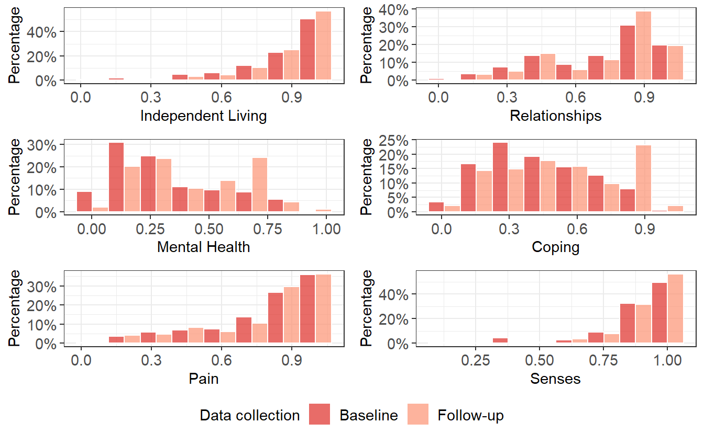

{} This below section renders a vignette article from the TTU library. You can use the following links to:

-   [view the vignette on the library website (adds useful hyperlinks to code blocks)](https://ready4-dev.github.io/TTU/articles/V_01.html)
-   [view the source file](https://github.com/ready4-dev/TTU/blob/main/vignettes/V_01.Rmd) from that article, and;
-   [edit its contents](https://github.com/ready4-dev/TTU/edit/main/vignettes/V_01.Rmd) (requires a GitHub account). {}

<div class="highlight">

</div>

Note: **This vignette uses fake data** - it is for illustrative purposes only and should not be used to inform decision making. This vignette outlines the workflow for developing utility mapping models using longitudinal data. The workflow for developing utility mapping models is broadly similar, with some minor modifications. An example of developing models using cross-sectional data is available at <https://doi.org/10.5281/zenodo.8098595> .

## Motivation

Health services do not typically collect health utility data from their clients, which makes it more difficult to place an economic values on outcomes attained in these services. One strategy for addressing this gap is to use data from similar samples of patients that contain both health utility and the types of outcome measures that are collected in clinical services. The TTU package provides a toolkit for conducting and reporting a utility mapping (or Transfer to Utility) study.

## Implementation

The TTU package contains [modules](https://www.ready4-dev.com/docs/framework/implementation/modularity/) of the [ready4 youth mental health economic model](https://www.ready4-dev.com/docs/model/) that combine and extend model modules for:

-   labeling, validating and summarising youth mental health datasets (from the [youthvars](https://ready4-dev.github.io/youthvars/) package);
-   scoring health utility (from the [scorz](https://ready4-dev.github.io/scorz/) package);
-   specifying and testing statistical models (from the [specific](https://ready4-dev.github.io/specific/) package);
-   generating reproducible analysis reports (from the [ready4show](https://ready4-dev.github.io/ready4show/) package); and
-   sharing data via online data repositories (from the [ready4use](https://ready4-dev.github.io/ready4use/) package).

Additionally, TTU relies on two RMarkdown programs:

-   ttu_mdl_ctlg: Generate a Template Utility Mapping (Transfer to Utility) Model Catalogue (<https://doi.org/10.5281/zenodo.5936870>)
-   ttu_lng_ss: Create a Draft Scientific Manuscript For A Utility Mapping Study (<https://doi.org/10.5281/zenodo.5976987>)

Outputs generated by the TTU package are designed to be compatible with health economic models developed with the [ready4 framework](https://www.ready4-dev.com)).

## Workflow

### Background and citation

The following workflow illustrates (**using fake data**) the same steps we used in a real world study, a summary of which is available at <https://doi.org/10.1101/2021.07.07.21260129>). Citation information for that study is:

<div class="highlight">

<pre class='chroma'><code class='language-r' data-lang='r'>@article {Hamilton2021.07.07.21260129,
    author = {Hamilton, Matthew P and Gao, Caroline X and Filia, Kate M and Menssink, Jana M and Sharmin, Sonia and Telford, Nic and Herrman, Helen and Hickie, Ian B and Mihalopoulos, Cathrine and Rickwood, Debra J and McGorry, Patrick D and Cotton, Sue M},
    title = {Predicting Quality Adjusted Life Years in young people attending primary mental health services},
    elocation-id = {2021.07.07.21260129},
    year = {2021},
    doi = {10.1101/2021.07.07.21260129},
    publisher = {Cold Spring Harbor Laboratory Press},
    URL = {https://www.medrxiv.org/content/early/2021/07/12/2021.07.07.21260129},
    eprint = {https://www.medrxiv.org/content/early/2021/07/12/2021.07.07.21260129.full.pdf},
    journal = {medRxiv}
}
</code></pre>

</div>

The program applied in that study, which this workflow closely resembles is available at <https://doi.org/10.5281/zenodo.6116077> and can be cited as follows:

<div class="highlight">

<pre class='chroma'><code class='language-r' data-lang='r'>@software{hamilton_matthew_2022_6212704,
  author       = {Hamilton, Matthew and
                  Gao, Caroline},
  title        = {{Complete study program to reproduce all steps from 
                   data ingest through to results dissemination for a
                   study to map mental health measures to AQoL-6D
                   health utility}},
  month        = feb,
  year         = 2022,
  note         = {{Matthew Hamilton and Caroline Gao  (2022). 
                   Complete study program to reproduce all steps from
                   data ingest through to results dissemination for a
                   study to map mental health measures to AQoL-6D
                   health utility. Zenodo.
                   https://doi.org/10.5281/zenodo.6116077. Version
                   0.0.9.3}},
  publisher    = {Zenodo},
  version      = {0.0.9.3},
  doi          = {10.5281/zenodo.6212704},
  url          = {https://doi.org/10.5281/zenodo.6212704}
}
</code></pre>

</div>

### Load required packages

We begin by loading our required packages.

<div class="highlight">

<pre class='chroma'><code class='language-r' data-lang='r'><span><span class='kr'><a href='https://rdrr.io/r/base/library.html'>library</a></span><span class='o'>(</span><span class='nv'><a href='https://ready4-dev.github.io/ready4/'>ready4</a></span><span class='o'>)</span></span>
<span><span class='kr'><a href='https://rdrr.io/r/base/library.html'>library</a></span><span class='o'>(</span><span class='nv'><a href='https://ready4-dev.github.io/ready4show/'>ready4show</a></span><span class='o'>)</span></span>
<span><span class='kr'><a href='https://rdrr.io/r/base/library.html'>library</a></span><span class='o'>(</span><span class='nv'><a href='https://ready4-dev.github.io/ready4use/'>ready4use</a></span><span class='o'>)</span></span>
<span><span class='kr'><a href='https://rdrr.io/r/base/library.html'>library</a></span><span class='o'>(</span><span class='nv'><a href='https://ready4-dev.github.io/youthvars/'>youthvars</a></span><span class='o'>)</span></span>
<span><span class='kr'><a href='https://rdrr.io/r/base/library.html'>library</a></span><span class='o'>(</span><span class='nv'><a href='https://ready4-dev.github.io/scorz/'>scorz</a></span><span class='o'>)</span></span>
<span><span class='kr'><a href='https://rdrr.io/r/base/library.html'>library</a></span><span class='o'>(</span><span class='nv'><a href='https://ready4-dev.github.io/TTU/'>TTU</a></span><span class='o'>)</span></span></code></pre>

</div>

### Set consent policy

By default, methods associated with TTU modules will request your consent before writing files to your machine. This is the safest option. However, as there are many files that need to be written locally for this program to execute, you can overwrite this default by supplying the value "Y" to methods with a `consent_1L_chr` argument.

<div class="highlight">

<pre class='chroma'><code class='language-r' data-lang='r'><span><span class='nv'>consent_1L_chr</span> <span class='o'>&lt;-</span> <span class='s'>""</span> <span class='c'># Default value - asks for consent prior to writing each file.</span></span></code></pre>

</div>

<div class="highlight">

</div>

### Add dataset metadata

We use the Ready4useDyad and Ready4useRepos modules to [retrieve and ingest](https://ready4-dev.github.io/ready4use/articles/V_01.html) and to then [pair a dataset and its data dictionary](_https://ready4-dev.github.io/ready4use/articles/V_02.html).

<div class="highlight">

<pre class='chroma'><code class='language-r' data-lang='r'><span><span class='nv'>A</span> <span class='o'>&lt;-</span> <span class='nf'><a href='https://ready4-dev.github.io/ready4use/reference/Ready4useDyad-class.html'>Ready4useDyad</a></span><span class='o'>(</span>ds_tb <span class='o'>=</span> <span class='nf'><a href='https://ready4-dev.github.io/ready4use/reference/Ready4useRepos-class.html'>Ready4useRepos</a></span><span class='o'>(</span>dv_nm_1L_chr <span class='o'>=</span> <span class='s'>"fakes"</span>, dv_ds_nm_1L_chr <span class='o'>=</span> <span class='s'>"https://doi.org/10.7910/DVN/HJXYKQ"</span>, dv_server_1L_chr <span class='o'>=</span> <span class='s'>"dataverse.harvard.edu"</span><span class='o'>)</span> <span class='o'><a href='https://magrittr.tidyverse.org/reference/pipe.html'>%&gt;%</a></span></span>
<span>                     <span class='nf'><a href='https://ready4-dev.github.io/ready4/reference/ingest-methods.html'>ingest</a></span><span class='o'>(</span>fls_to_ingest_chr <span class='o'>=</span> <span class='nf'><a href='https://rdrr.io/r/base/c.html'>c</a></span><span class='o'>(</span><span class='s'>"ymh_clinical_tb"</span><span class='o'>)</span>, metadata_1L_lgl <span class='o'>=</span> <span class='kc'>F</span><span class='o'>)</span> <span class='o'><a href='https://magrittr.tidyverse.org/reference/pipe.html'>%&gt;%</a></span> <span class='nf'>youthvars</span><span class='nf'>::</span><span class='nf'><a href='https://ready4-dev.github.io/youthvars/reference/transform_raw_ds_for_analysis.html'>transform_raw_ds_for_analysis</a></span><span class='o'>(</span><span class='o'>)</span>,</span>
<span>                   dictionary_r3 <span class='o'>=</span> <span class='nf'><a href='https://ready4-dev.github.io/ready4use/reference/Ready4useRepos-class.html'>Ready4useRepos</a></span><span class='o'>(</span>dv_nm_1L_chr <span class='o'>=</span> <span class='s'>"TTU"</span>, dv_ds_nm_1L_chr <span class='o'>=</span> <span class='s'>"https://doi.org/10.7910/DVN/DKDIB0"</span>, dv_server_1L_chr <span class='o'>=</span> <span class='s'>"dataverse.harvard.edu"</span><span class='o'>)</span> <span class='o'><a href='https://magrittr.tidyverse.org/reference/pipe.html'>%&gt;%</a></span></span>
<span>                     <span class='nf'><a href='https://ready4-dev.github.io/ready4/reference/ingest-methods.html'>ingest</a></span><span class='o'>(</span>fls_to_ingest_chr <span class='o'>=</span> <span class='nf'><a href='https://rdrr.io/r/base/c.html'>c</a></span><span class='o'>(</span><span class='s'>"dictionary_r3"</span><span class='o'>)</span>, metadata_1L_lgl <span class='o'>=</span> <span class='kc'>F</span><span class='o'>)</span><span class='o'>)</span> <span class='o'><a href='https://magrittr.tidyverse.org/reference/pipe.html'>%&gt;%</a></span></span>
<span>  <span class='nf'><a href='https://ready4-dev.github.io/ready4/reference/renew-methods.html'>renew</a></span><span class='o'>(</span>type_1L_chr <span class='o'>=</span> <span class='s'>"label"</span><span class='o'>)</span></span></code></pre>

</div>

We use the YouthvarsSeries module to [supply metadata about our longitudinal dataset vignette](https://ready4-dev.github.io/youthvars/articles/V_02.html).

<div class="highlight">

<pre class='chroma'><code class='language-r' data-lang='r'><span><span class='nv'>A</span> <span class='o'>&lt;-</span> <span class='nf'><a href='https://ready4-dev.github.io/youthvars/reference/YouthvarsSeries-class.html'>YouthvarsSeries</a></span><span class='o'>(</span>a_Ready4useDyad <span class='o'>=</span> <span class='nv'>A</span>, id_var_nm_1L_chr <span class='o'>=</span> <span class='s'>"fkClientID"</span>, timepoint_var_nm_1L_chr <span class='o'>=</span> <span class='s'>"round"</span>,</span>
<span>                     timepoint_vals_chr <span class='o'>=</span> <span class='nf'><a href='https://rdrr.io/r/base/levels.html'>levels</a></span><span class='o'>(</span><span class='nf'><a href='https://ready4-dev.github.io/ready4/reference/procureSlot-methods.html'>procureSlot</a></span><span class='o'>(</span><span class='nv'>A</span>, <span class='s'>"ds_tb"</span><span class='o'>)</span><span class='o'>$</span><span class='nv'>round</span><span class='o'>)</span><span class='o'>)</span></span></code></pre>

</div>

### Score health utility

We next use the ScorzAqol6Adol module to [score adolescent AQoL-6D health utility](https://ready4-dev.github.io/scorz/articles/V_01.html).

<div class="highlight">

<pre class='chroma'><code class='language-r' data-lang='r'><span><span class='nv'>A</span> <span class='o'>&lt;-</span> <span class='nf'><a href='https://ready4-dev.github.io/TTU/reference/TTUProject-class.html'>TTUProject</a></span><span class='o'>(</span>a_ScorzProfile <span class='o'>=</span> <span class='nf'><a href='https://ready4-dev.github.io/scorz/reference/ScorzAqol6Adol-class.html'>ScorzAqol6Adol</a></span><span class='o'>(</span>a_YouthvarsProfile <span class='o'>=</span> <span class='nv'>A</span><span class='o'>)</span><span class='o'>)</span></span>
<span><span class='nv'>A</span> <span class='o'>&lt;-</span> <span class='nf'><a href='https://ready4-dev.github.io/ready4/reference/renew-methods.html'>renew</a></span><span class='o'>(</span><span class='nv'>A</span>, what_1L_chr <span class='o'>=</span> <span class='s'>"utility"</span><span class='o'>)</span> </span>
<span><span class='c'>#&gt; Joining with `by = join_by(fkClientID, match_var_chr)`</span></span>
<span></span></code></pre>

</div>

### Evaluate candidate models

Over the next few steps we will use modules from the specific package to [specify and assess a number of candidate utility mapping models](https://ready4-dev.github.io/specific/articles/V_01.html).

#### Specify modelling parameters

We begin by specifying the parameters we will use in our modelling project. The initial step is to ensure the fields in `A` for storing parameter values are internally consistent with the data we have entered in the previous steps.

<div class="highlight">

<pre class='chroma'><code class='language-r' data-lang='r'><span><span class='nv'>A</span> <span class='o'>&lt;-</span> <span class='nf'><a href='https://ready4-dev.github.io/ready4/reference/renew-methods.html'>renew</a></span><span class='o'>(</span><span class='nv'>A</span>, what_1L_chr <span class='o'>=</span> <span class='s'>"parameters"</span><span class='o'>)</span></span></code></pre>

</div>

We next ingest a lookup table of metadata about the variables we plan to explore as candidate predictors. In this case, we are sourcing the lookup table from an online data repository.

<div class="highlight">

<pre class='chroma'><code class='language-r' data-lang='r'><span><span class='nv'>A</span> <span class='o'>&lt;-</span> <span class='nf'><a href='https://ready4-dev.github.io/ready4/reference/renew-methods.html'>renew</a></span><span class='o'>(</span><span class='nv'>A</span>, <span class='s'>"use_renew_mthd"</span>, fl_nm_1L_chr <span class='o'>=</span> <span class='s'>"predictors_r3"</span>, type_1L_chr <span class='o'>=</span> <span class='s'>"predictors_lup"</span>, </span>
<span>           y_Ready4useRepos <span class='o'>=</span> <span class='nf'><a href='https://ready4-dev.github.io/ready4use/reference/Ready4useRepos-class.html'>Ready4useRepos</a></span><span class='o'>(</span>dv_nm_1L_chr <span class='o'>=</span> <span class='s'>"TTU"</span>, dv_ds_nm_1L_chr <span class='o'>=</span> <span class='s'>"https://doi.org/10.7910/DVN/DKDIB0"</span>, </span>
<span>                                             dv_server_1L_chr <span class='o'>=</span> <span class='s'>"dataverse.harvard.edu"</span><span class='o'>)</span>,</span>
<span>           what_1L_chr <span class='o'>=</span> <span class='s'>"parameters"</span><span class='o'>)</span></span></code></pre>

</div>

We can inspect the metadata on candidate predictors that we have just ingested.

<div class="highlight">

<pre class='chroma'><code class='language-r' data-lang='r'><span><span class='nf'><a href='https://ready4-dev.github.io/ready4/reference/exhibit-methods.html'>exhibit</a></span><span class='o'>(</span><span class='nv'>A</span>, scroll_box_args_ls <span class='o'>=</span> <span class='nf'><a href='https://rdrr.io/r/base/list.html'>list</a></span><span class='o'>(</span>width <span class='o'>=</span> <span class='s'>"100%"</span><span class='o'>)</span><span class='o'>)</span></span></code></pre>

</div>

We add additional metadata about variables in our dataset that will be used in exploratory modelling.

<div class="highlight">

<pre class='chroma'><code class='language-r' data-lang='r'><span><span class='nv'>A</span> <span class='o'>&lt;-</span> <span class='nf'><a href='https://ready4-dev.github.io/ready4/reference/renew-methods.html'>renew</a></span><span class='o'>(</span><span class='nv'>A</span>, <span class='nf'><a href='https://rdrr.io/r/base/c.html'>c</a></span><span class='o'>(</span><span class='m'>0.03</span>,<span class='m'>1</span><span class='o'>)</span>, type_1L_chr <span class='o'>=</span> <span class='s'>"range"</span>, what_1L_chr <span class='o'>=</span> <span class='s'>"parameters"</span><span class='o'>)</span> <span class='o'><a href='https://magrittr.tidyverse.org/reference/pipe.html'>%&gt;%</a></span></span>
<span>  <span class='nf'><a href='https://ready4-dev.github.io/ready4/reference/renew-methods.html'>renew</a></span><span class='o'>(</span><span class='nf'><a href='https://rdrr.io/r/base/c.html'>c</a></span><span class='o'>(</span><span class='s'>"BADS"</span>,<span class='s'>"GAD7"</span>, <span class='s'>"K6"</span>, <span class='s'>"OASIS"</span>, <span class='s'>"PHQ9"</span>, <span class='s'>"SCARED"</span><span class='o'>)</span>,</span>
<span>        type_1L_chr <span class='o'>=</span> <span class='s'>"predictors_vars"</span>, what_1L_chr <span class='o'>=</span> <span class='s'>"parameters"</span><span class='o'>)</span> <span class='o'><a href='https://magrittr.tidyverse.org/reference/pipe.html'>%&gt;%</a></span></span>
<span>  <span class='nf'><a href='https://ready4-dev.github.io/ready4/reference/renew-methods.html'>renew</a></span><span class='o'>(</span><span class='nf'><a href='https://rdrr.io/r/base/c.html'>c</a></span><span class='o'>(</span><span class='s'>"d_sex_birth_s"</span>, <span class='s'>"d_age"</span>,  <span class='s'>"d_sexual_ori_s"</span>, <span class='s'>"d_studying_working"</span>, <span class='s'>"c_p_diag_s"</span>, <span class='s'>"c_clinical_staging_s"</span>, <span class='s'>"SOFAS"</span><span class='o'>)</span>,     </span>
<span>        type_1L_chr <span class='o'>=</span> <span class='s'>"covariates"</span>, what_1L_chr <span class='o'>=</span> <span class='s'>"parameters"</span><span class='o'>)</span> <span class='o'><a href='https://magrittr.tidyverse.org/reference/pipe.html'>%&gt;%</a></span></span>
<span>  <span class='nf'><a href='https://ready4-dev.github.io/ready4/reference/renew-methods.html'>renew</a></span><span class='o'>(</span><span class='nf'><a href='https://rdrr.io/r/base/c.html'>c</a></span><span class='o'>(</span><span class='s'>"d_age"</span>,<span class='s'>"Gender"</span>,<span class='s'>"d_relation_s"</span>, <span class='s'>"d_sexual_ori_s"</span> ,<span class='s'>"Region"</span>, <span class='s'>"d_studying_working"</span>, <span class='s'>"c_p_diag_s"</span>, <span class='s'>"c_clinical_staging_s"</span>,<span class='s'>"SOFAS"</span><span class='o'>)</span>, </span>
<span>        type_1L_chr <span class='o'>=</span> <span class='s'>"descriptives"</span>, what_1L_chr <span class='o'>=</span> <span class='s'>"parameters"</span><span class='o'>)</span> <span class='o'><a href='https://magrittr.tidyverse.org/reference/pipe.html'>%&gt;%</a></span></span>
<span>  <span class='nf'><a href='https://ready4-dev.github.io/ready4/reference/renew-methods.html'>renew</a></span><span class='o'>(</span><span class='s'>"d_interview_date"</span>, type_1L_chr <span class='o'>=</span> <span class='s'>"temporal"</span>, what_1L_chr <span class='o'>=</span> <span class='s'>"parameters"</span><span class='o'>)</span></span></code></pre>

</div>

We record that the data we are working with is fake (this step can be skipped if working with real data).

<div class="highlight">

<pre class='chroma'><code class='language-r' data-lang='r'><span><span class='nv'>A</span> <span class='o'>&lt;-</span> <span class='nf'><a href='https://ready4-dev.github.io/ready4/reference/renew-methods.html'>renew</a></span><span class='o'>(</span><span class='nv'>A</span>, <span class='kc'>T</span>, type_1L_chr <span class='o'>=</span> <span class='s'>"is_fake"</span>, what_1L_chr <span class='o'>=</span> <span class='s'>"parameters"</span><span class='o'>)</span></span></code></pre>

</div>

We update `A` for internal consistency with the values we have previously supplied and create a local workspace to which output files will be written.

<div class="highlight">

<pre class='chroma'><code class='language-r' data-lang='r'><span><span class='nv'>A</span> <span class='o'>&lt;-</span> <span class='nf'><a href='https://ready4-dev.github.io/ready4/reference/renew-methods.html'>renew</a></span><span class='o'>(</span><span class='nv'>A</span>, consent_1L_chr <span class='o'>=</span> <span class='nv'>consent_1L_chr</span>, paths_chr <span class='o'>=</span> <span class='nf'><a href='https://rdrr.io/r/base/tempfile.html'>tempdir</a></span><span class='o'>(</span><span class='o'>)</span>, what_1L_chr <span class='o'>=</span> <span class='s'>"project"</span><span class='o'>)</span></span></code></pre>

</div>

We now generate tables and charts that describe our dataset. These are saved in a sub-directory of our output data directory, and are [available for download](https://github.com/ready4-dev/TTU/releases/download/Documentation_0.0/_Descriptives.zip). One of the plots is also reproduced here.

<div class="highlight">

<pre class='chroma'><code class='language-r' data-lang='r'><span><span class='nv'>A</span> <span class='o'>&lt;-</span> <span class='nf'><a href='https://ready4-dev.github.io/ready4/reference/author-methods.html'>author</a></span><span class='o'>(</span><span class='nv'>A</span>, consent_1L_chr <span class='o'>=</span> <span class='nv'>consent_1L_chr</span>, digits_1L_int <span class='o'>=</span> <span class='m'>3L</span>, what_1L_chr <span class='o'>=</span> <span class='s'>"descriptives"</span><span class='o'>)</span></span>
</code></pre>


</div>

We next compare the performance of different model types. We perform this step using the `investigate` method. This is the first of several times that we use this method. Each time the method is called `A` is updated to that the next time the method is called, a different algorithm will be used. The sequence of calls to `investigate` is therefore important (it should be in the same order as outlined in this example and you should not attempt to repeat a call to `investigate` to redo a prior step).

<div class="highlight">

<pre class='chroma'><code class='language-r' data-lang='r'><span><span class='nv'>A</span> <span class='o'>&lt;-</span> <span class='nf'><a href='https://ready4-dev.github.io/ready4/reference/investigate-methods.html'>investigate</a></span><span class='o'>(</span><span class='nv'>A</span>, consent_1L_chr <span class='o'>=</span> <span class='nv'>consent_1L_chr</span>, depnt_var_max_val_1L_dbl <span class='o'>=</span> <span class='m'>0.9999</span>, session_ls <span class='o'>=</span> <span class='nf'><a href='https://rdrr.io/r/utils/sessionInfo.html'>sessionInfo</a></span><span class='o'>(</span><span class='o'>)</span><span class='o'>)</span></span></code></pre>

</div>

The outputs of the previous command are saved into a sub-directory of our output directory. An example of this output is [available for download](https://github.com/ready4-dev/TTU/releases/download/Documentation_0.0/A_Candidate_Mdls_Cmprsn.zip)). Once we inspect this output, we can then specify the preferred model types to use from this point onwards.

<div class="highlight">

<pre class='chroma'><code class='language-r' data-lang='r'><span><span class='nv'>A</span> <span class='o'>&lt;-</span> <span class='nf'><a href='https://ready4-dev.github.io/ready4/reference/renew-methods.html'>renew</a></span><span class='o'>(</span><span class='nv'>A</span>, <span class='nf'><a href='https://rdrr.io/r/base/c.html'>c</a></span><span class='o'>(</span><span class='s'>"GLM_GSN_LOG"</span>, <span class='s'>"OLS_CLL"</span><span class='o'>)</span>, type_1L_chr <span class='o'>=</span> <span class='s'>"models"</span>, what_1L_chr <span class='o'>=</span> <span class='s'>"results"</span><span class='o'>)</span></span></code></pre>

</div>

Next we assess multiple versions of our preferred model type - one single predictor model for each of our candidate predictors and the same models with candidate covariates added.

<div class="highlight">

<pre class='chroma'><code class='language-r' data-lang='r'><span><span class='nv'>A</span> <span class='o'>&lt;-</span> <span class='nf'><a href='https://ready4-dev.github.io/ready4/reference/investigate-methods.html'>investigate</a></span><span class='o'>(</span><span class='nv'>A</span>, consent_1L_chr <span class='o'>=</span> <span class='nv'>consent_1L_chr</span><span class='o'>)</span></span></code></pre>

</div>

The previous step saved output into a sub-directory of our output directory. Example output is available for download: ([single predictor comparisons](https://github.com/ready4-dev/TTU/releases/download/Documentation_0.0/B_Candidate_Predrs_Cmprsn.zip)) and [multivariate model comparisons](https://github.com/ready4-dev/TTU/releases/download/Documentation_0.0/C_Predrs_Sngl_Mdl_Cmprsn.zip). After reviewing this output, we can specify the covariates we wish to add to the models we will assess from this point forward.

<div class="highlight">

<pre class='chroma'><code class='language-r' data-lang='r'><span><span class='nv'>A</span> <span class='o'>&lt;-</span> <span class='nf'><a href='https://ready4-dev.github.io/ready4/reference/renew-methods.html'>renew</a></span><span class='o'>(</span><span class='nv'>A</span>, <span class='s'>"SOFAS"</span>, type_1L_chr <span class='o'>=</span> <span class='s'>"covariates"</span>, what_1L_chr <span class='o'>=</span> <span class='s'>"results"</span><span class='o'>)</span></span></code></pre>

</div>

We can now assess the multivariate models.

<div class="highlight">

<pre class='chroma'><code class='language-r' data-lang='r'><span><span class='nv'>A</span> <span class='o'>&lt;-</span> <span class='nf'><a href='https://ready4-dev.github.io/ready4/reference/investigate-methods.html'>investigate</a></span><span class='o'>(</span><span class='nv'>A</span>, consent_1L_chr <span class='o'>=</span> <span class='nv'>consent_1L_chr</span><span class='o'>)</span></span></code></pre>

</div>

As a result of the previous step, more model objects and plot files have been saved to a sub-directory of our output directory. Examples of this output are available for download [here](https://github.com/ready4-dev/TTU/releases/download/Documentation_0.0/D_Predr_Covars_Cmprsn.zip) and [here](https://github.com/ready4-dev/TTU/releases/download/Documentation_0.0/E_Predrs_W_Covars_Sngl_Mdl_Cmprsn.zip). Once we inspect this output we can reformulate the models we finalised in the previous step so that they are suitable for modelling longitudinal change. For our primary analysis, we use a mixed model formulation of the models that we previously selected. A series of large model files are written to the local output data directory.

<div class="highlight">

<pre class='chroma'><code class='language-r' data-lang='r'><span><span class='nv'>A</span> <span class='o'>&lt;-</span> <span class='nf'><a href='https://ready4-dev.github.io/ready4/reference/investigate-methods.html'>investigate</a></span><span class='o'>(</span><span class='nv'>A</span>, consent_1L_chr <span class='o'>=</span> <span class='nv'>consent_1L_chr</span><span class='o'>)</span></span></code></pre>

</div>

For our secondary analyses, we specify alternative combinations of predictors and covariates.

<div class="highlight">

<pre class='chroma'><code class='language-r' data-lang='r'><span><span class='nv'>A</span> <span class='o'>&lt;-</span> <span class='nf'><a href='https://ready4-dev.github.io/ready4/reference/investigate-methods.html'>investigate</a></span><span class='o'>(</span><span class='nv'>A</span>, consent_1L_chr <span class='o'>=</span> <span class='nv'>consent_1L_chr</span>,</span>
<span>                 scndry_anlys_params_ls <span class='o'>=</span> <span class='nf'><a href='https://ready4-dev.github.io/specific/reference/make_scndry_anlys_params.html'>make_scndry_anlys_params</a></span><span class='o'>(</span>candidate_predrs_chr <span class='o'>=</span> <span class='nf'><a href='https://rdrr.io/r/base/c.html'>c</a></span><span class='o'>(</span><span class='s'>"SOFAS"</span><span class='o'>)</span>,</span>
<span>                                                                   candidate_covar_nms_chr <span class='o'>=</span> <span class='nf'><a href='https://rdrr.io/r/base/c.html'>c</a></span><span class='o'>(</span><span class='s'>"d_sex_birth_s"</span>, <span class='s'>"d_age"</span>, <span class='s'>"d_sexual_ori_s"</span>, <span class='s'>"d_studying_working"</span><span class='o'>)</span>,</span>
<span>                                                                   prefd_covars_chr <span class='o'>=</span> <span class='kc'>NA_character_</span><span class='o'>)</span> <span class='o'><a href='https://magrittr.tidyverse.org/reference/pipe.html'>%&gt;%</a></span></span>
<span>                   <span class='nf'><a href='https://ready4-dev.github.io/specific/reference/make_scndry_anlys_params.html'>make_scndry_anlys_params</a></span><span class='o'>(</span>candidate_predrs_chr <span class='o'>=</span> <span class='nf'><a href='https://rdrr.io/r/base/c.html'>c</a></span><span class='o'>(</span><span class='s'>"SCARED"</span>,<span class='s'>"OASIS"</span>,<span class='s'>"GAD7"</span><span class='o'>)</span>,</span>
<span>                                            candidate_covar_nms_chr <span class='o'>=</span> <span class='nf'><a href='https://rdrr.io/r/base/c.html'>c</a></span><span class='o'>(</span><span class='s'>"PHQ9"</span>, <span class='s'>"SOFAS"</span>, <span class='s'>"d_sex_birth_s"</span>, <span class='s'>"d_age"</span>, <span class='s'>"d_sexual_ori_s"</span>, <span class='s'>"d_studying_working"</span><span class='o'>)</span>,</span>
<span>                                            prefd_covars_chr <span class='o'>=</span> <span class='s'>"PHQ9"</span><span class='o'>)</span><span class='o'>)</span></span></code></pre>

</div>

### Report findings

#### Create shareable models

The model objects created and saved in our working directory by the preceding steps are not suitable for public dissemination. They are both too large in file size and, more importantly, include copies of our source dataset. We can overcome these limitations by creating shareable versions of the models. Two types of shareable version are created - copies of the original model objects in which fake data overwrites the original source data and summary tables of model coefficients.

<div class="highlight">

<pre class='chroma'><code class='language-r' data-lang='r'><span><span class='nv'>A</span> <span class='o'>&lt;-</span> <span class='nf'><a href='https://ready4-dev.github.io/ready4/reference/author-methods.html'>author</a></span><span class='o'>(</span><span class='nv'>A</span>, consent_1L_chr <span class='o'>=</span> <span class='nv'>consent_1L_chr</span>, what_1L_chr <span class='o'>=</span> <span class='s'>"models"</span><span class='o'>)</span></span></code></pre>

</div>

#### Specify study reporting metadata

We update `A` so that we can begin use it to render and share reports.

<div class="highlight">

<pre class='chroma'><code class='language-r' data-lang='r'><span><span class='nv'>A</span> <span class='o'>&lt;-</span> <span class='nf'><a href='https://ready4-dev.github.io/ready4/reference/renew-methods.html'>renew</a></span><span class='o'>(</span><span class='nv'>A</span>, what_1L_chr <span class='o'>=</span> <span class='s'>"reporting"</span><span class='o'>)</span></span></code></pre>

</div>

We add metadata relevant to the reports that we will be generating to these fields. Note that the data we supply to the Ready4useRepos object below must relate to a repository to which we have write permissions (otherwise subsequent steps will fail).

<div class="highlight">

<pre class='chroma'><code class='language-r' data-lang='r'><span><span class='nv'>A</span> <span class='o'>&lt;-</span> <span class='nf'><a href='https://ready4-dev.github.io/ready4/reference/renew-methods.html'>renew</a></span><span class='o'>(</span><span class='nv'>A</span>, <span class='nf'>ready4show</span><span class='nf'>::</span><span class='nv'><a href='https://ready4-dev.github.io/ready4show/reference/authors_tb.html'>authors_tb</a></span>, type_1L_chr <span class='o'>=</span> <span class='s'>"authors"</span>, what_1L_chr <span class='o'>=</span> <span class='s'>"reporting"</span><span class='o'>)</span> <span class='o'><a href='https://magrittr.tidyverse.org/reference/pipe.html'>%&gt;%</a></span></span>
<span>  <span class='nf'><a href='https://ready4-dev.github.io/ready4/reference/renew-methods.html'>renew</a></span><span class='o'>(</span><span class='nf'>ready4show</span><span class='nf'>::</span><span class='nv'><a href='https://ready4-dev.github.io/ready4show/reference/institutes_tb.html'>institutes_tb</a></span>, type_1L_chr <span class='o'>=</span> <span class='s'>"institutes"</span>, what_1L_chr <span class='o'>=</span> <span class='s'>"reporting"</span><span class='o'>)</span> <span class='o'><a href='https://magrittr.tidyverse.org/reference/pipe.html'>%&gt;%</a></span></span>
<span>  <span class='nf'><a href='https://ready4-dev.github.io/ready4/reference/renew-methods.html'>renew</a></span><span class='o'>(</span><span class='nf'><a href='https://rdrr.io/r/base/c.html'>c</a></span><span class='o'>(</span><span class='m'>3L</span>,<span class='m'>3L</span><span class='o'>)</span>, type_1L_chr <span class='o'>=</span> <span class='s'>"digits"</span>, what_1L_chr <span class='o'>=</span> <span class='s'>"reporting"</span><span class='o'>)</span> <span class='o'><a href='https://magrittr.tidyverse.org/reference/pipe.html'>%&gt;%</a></span></span>
<span>  <span class='nf'><a href='https://ready4-dev.github.io/ready4/reference/renew-methods.html'>renew</a></span><span class='o'>(</span><span class='nf'><a href='https://rdrr.io/r/base/c.html'>c</a></span><span class='o'>(</span><span class='s'>"PDF"</span>,<span class='s'>"PDF"</span><span class='o'>)</span>, type_1L_chr <span class='o'>=</span> <span class='s'>"formats"</span>, what_1L_chr <span class='o'>=</span> <span class='s'>"reporting"</span><span class='o'>)</span> <span class='o'><a href='https://magrittr.tidyverse.org/reference/pipe.html'>%&gt;%</a></span></span>
<span>  <span class='nf'><a href='https://ready4-dev.github.io/ready4/reference/renew-methods.html'>renew</a></span><span class='o'>(</span><span class='s'>"A hypothetical utility mapping study using fake data"</span>, type_1L_chr <span class='o'>=</span> <span class='s'>"title"</span>, what_1L_chr <span class='o'>=</span> <span class='s'>"reporting"</span><span class='o'>)</span> <span class='o'><a href='https://magrittr.tidyverse.org/reference/pipe.html'>%&gt;%</a></span></span>
<span>  <span class='nf'><a href='https://ready4-dev.github.io/ready4/reference/renew-methods.html'>renew</a></span><span class='o'>(</span><span class='nf'><a href='https://ready4-dev.github.io/ready4/reference/renew-methods.html'>renew</a></span><span class='o'>(</span><span class='nf'><a href='https://ready4-dev.github.io/ready4show/reference/ready4show_correspondences.html'>ready4show_correspondences</a></span><span class='o'>(</span><span class='o'>)</span>, old_nms_chr <span class='o'>=</span> <span class='nf'><a href='https://rdrr.io/r/base/c.html'>c</a></span><span class='o'>(</span><span class='s'>"PHQ9"</span>, <span class='s'>"GAD7"</span><span class='o'>)</span>, new_nms_chr <span class='o'>=</span> <span class='nf'><a href='https://rdrr.io/r/base/c.html'>c</a></span><span class='o'>(</span><span class='s'>"PHQ-9"</span>, <span class='s'>"GAD-7"</span><span class='o'>)</span><span class='o'>)</span>, type_1L_chr <span class='o'>=</span> <span class='s'>"changes"</span>, what_1L_chr <span class='o'>=</span> <span class='s'>"reporting"</span><span class='o'>)</span> <span class='o'><a href='https://magrittr.tidyverse.org/reference/pipe.html'>%&gt;%</a></span></span>
<span>  <span class='nf'><a href='https://ready4-dev.github.io/ready4/reference/renew-methods.html'>renew</a></span><span class='o'>(</span><span class='nf'><a href='https://ready4-dev.github.io/ready4use/reference/Ready4useRepos-class.html'>Ready4useRepos</a></span><span class='o'>(</span>dv_nm_1L_chr <span class='o'>=</span> <span class='s'>"fakes"</span>, dv_ds_nm_1L_chr <span class='o'>=</span> <span class='s'>"https://doi.org/10.7910/DVN/D74QMP"</span>, dv_server_1L_chr <span class='o'>=</span> <span class='s'>"dataverse.harvard.edu"</span><span class='o'>)</span>, type_1L_chr <span class='o'>=</span> <span class='s'>"repos"</span>, what_1L_chr <span class='o'>=</span> <span class='s'>"reporting"</span><span class='o'>)</span> </span></code></pre>

</div>

#### Author model catalogues

We download a program for generating a catalogue of models and use it to summarising the models created under each study analysis (one primary and two secondary). The catalogues are saved locally.

<div class="highlight">

<pre class='chroma'><code class='language-r' data-lang='r'><span><span class='nv'>A</span> <span class='o'>&lt;-</span> <span class='nf'><a href='https://ready4-dev.github.io/ready4/reference/author-methods.html'>author</a></span><span class='o'>(</span><span class='nv'>A</span>, consent_1L_chr <span class='o'>=</span> <span class='nv'>consent_1L_chr</span>, download_tmpl_1L_lgl <span class='o'>=</span> <span class='kc'>T</span>, what_1L_chr <span class='o'>=</span> <span class='s'>"catalogue"</span><span class='o'>)</span></span></code></pre>

</div>

#### Author manuscript

We add some content about the manuscript we wish to author.

<div class="highlight">

<pre class='chroma'><code class='language-r' data-lang='r'><span><span class='nv'>A</span> <span class='o'>&lt;-</span> <span class='nf'><a href='https://ready4-dev.github.io/ready4/reference/renew-methods.html'>renew</a></span><span class='o'>(</span><span class='nv'>A</span>, <span class='s'>"Quality Adjusted Life Years (QALYs) are often used in economic evaluations, yet utility weights for deriving them are rarely directly measured in mental health services."</span>, </span>
<span>           type_1L_chr <span class='o'>=</span> <span class='s'>"background"</span>, what_1L_chr <span class='o'>=</span> <span class='s'>"reporting"</span><span class='o'>)</span> <span class='o'><a href='https://magrittr.tidyverse.org/reference/pipe.html'>%&gt;%</a></span></span>
<span>  <span class='nf'><a href='https://ready4-dev.github.io/ready4/reference/renew-methods.html'>renew</a></span><span class='o'>(</span><span class='s'>"None declared"</span>, type_1L_chr <span class='o'>=</span> <span class='s'>"conflicts"</span>, what_1L_chr <span class='o'>=</span> <span class='s'>"reporting"</span><span class='o'>)</span> <span class='o'><a href='https://magrittr.tidyverse.org/reference/pipe.html'>%&gt;%</a></span></span>
<span>  <span class='nf'><a href='https://ready4-dev.github.io/ready4/reference/renew-methods.html'>renew</a></span><span class='o'>(</span><span class='s'>"Nothing should be concluded from this study as it is purely hypothetical."</span>, type_1L_chr <span class='o'>=</span> <span class='s'>"conclusion"</span>, what_1L_chr <span class='o'>=</span> <span class='s'>"reporting"</span><span class='o'>)</span> <span class='o'><a href='https://magrittr.tidyverse.org/reference/pipe.html'>%&gt;%</a></span></span>
<span>  <span class='nf'><a href='https://ready4-dev.github.io/ready4/reference/renew-methods.html'>renew</a></span><span class='o'>(</span><span class='s'>"The study was reviewed and granted approval by no-one."</span> , type_1L_chr <span class='o'>=</span> <span class='s'>"ethics"</span>, what_1L_chr <span class='o'>=</span> <span class='s'>"reporting"</span><span class='o'>)</span> <span class='o'><a href='https://magrittr.tidyverse.org/reference/pipe.html'>%&gt;%</a></span></span>
<span>  <span class='nf'><a href='https://ready4-dev.github.io/ready4/reference/renew-methods.html'>renew</a></span><span class='o'>(</span><span class='s'>"The study was funded by no-one."</span>, type_1L_chr <span class='o'>=</span> <span class='s'>"funding"</span>, what_1L_chr <span class='o'>=</span> <span class='s'>"reporting"</span><span class='o'>)</span> <span class='o'><a href='https://magrittr.tidyverse.org/reference/pipe.html'>%&gt;%</a></span></span>
<span>  <span class='nf'><a href='https://ready4-dev.github.io/ready4/reference/renew-methods.html'>renew</a></span><span class='o'>(</span><span class='s'>"three months"</span>, type_1L_chr <span class='o'>=</span> <span class='s'>"interval"</span>, what_1L_chr <span class='o'>=</span> <span class='s'>"reporting"</span><span class='o'>)</span> <span class='o'><a href='https://magrittr.tidyverse.org/reference/pipe.html'>%&gt;%</a></span></span>
<span>  <span class='nf'><a href='https://ready4-dev.github.io/ready4/reference/renew-methods.html'>renew</a></span><span class='o'>(</span><span class='nf'><a href='https://rdrr.io/r/base/c.html'>c</a></span><span class='o'>(</span><span class='s'>"anxiety"</span>, <span class='s'>"AQoL"</span>,<span class='s'>"depression"</span>, <span class='s'>"psychological distress"</span>, <span class='s'>"QALYs"</span>, <span class='s'>"utility mapping"</span><span class='o'>)</span>, type_1L_chr <span class='o'>=</span> <span class='s'>"keywords"</span>, what_1L_chr <span class='o'>=</span> <span class='s'>"reporting"</span><span class='o'>)</span> <span class='o'><a href='https://magrittr.tidyverse.org/reference/pipe.html'>%&gt;%</a></span></span>
<span>  <span class='nf'><a href='https://ready4-dev.github.io/ready4/reference/renew-methods.html'>renew</a></span><span class='o'>(</span><span class='s'>"The study sample is fake data."</span>, type_1L_chr <span class='o'>=</span> <span class='s'>"sample"</span>, what_1L_chr <span class='o'>=</span> <span class='s'>"reporting"</span><span class='o'>)</span> </span></code></pre>

</div>

We create a brief summary of results that can be interpreted by the program that authors the manuscript.

<div class="highlight">

<pre class='chroma'><code class='language-r' data-lang='r'><span><span class='nv'>A</span> <span class='o'>&lt;-</span> <span class='nf'><a href='https://ready4-dev.github.io/ready4/reference/renew-methods.html'>renew</a></span><span class='o'>(</span><span class='nv'>A</span>, <span class='nf'><a href='https://rdrr.io/r/base/c.html'>c</a></span><span class='o'>(</span><span class='s'>"AQoL-6D"</span>, <span class='s'>"Adolescent AQoL Six Dimension"</span><span class='o'>)</span>, type_1L_chr <span class='o'>=</span> <span class='s'>"naming"</span>, what_1L_chr <span class='o'>=</span> <span class='s'>"reporting"</span><span class='o'>)</span></span></code></pre>

</div>

<div class="highlight">

<pre class='chroma'><code class='language-r' data-lang='r'><span><span class='nv'>A</span> <span class='o'>&lt;-</span> <span class='nf'><a href='https://ready4-dev.github.io/ready4/reference/renew-methods.html'>renew</a></span><span class='o'>(</span><span class='nv'>A</span>, <span class='s'>"use_renew_mthd"</span>, type_1L_chr <span class='o'>=</span> <span class='s'>"abstract"</span>, what_1L_chr <span class='o'>=</span> <span class='s'>"reporting"</span><span class='o'>)</span></span></code></pre>

</div>

We create and save the plots that will be used in the manuscript.

<div class="highlight">

<pre class='chroma'><code class='language-r' data-lang='r'><span><span class='nv'>A</span> <span class='o'>&lt;-</span> <span class='nf'><a href='https://ready4-dev.github.io/ready4/reference/author-methods.html'>author</a></span><span class='o'>(</span><span class='nv'>A</span>, consent_1L_chr <span class='o'>=</span> <span class='nv'>consent_1L_chr</span>, what_1L_chr <span class='o'>=</span> <span class='s'>"plots"</span><span class='o'>)</span></span></code></pre>

</div>

We download a program for generating a template manuscript and run it to author a first draft of the manuscript.

<div class="highlight">

<pre class='chroma'><code class='language-r' data-lang='r'><span><span class='nv'>A</span> <span class='o'>&lt;-</span> <span class='nf'><a href='https://ready4-dev.github.io/ready4/reference/author-methods.html'>author</a></span><span class='o'>(</span><span class='nv'>A</span>, consent_1L_chr <span class='o'>=</span> <span class='nv'>consent_1L_chr</span>, download_tmpl_1L_lgl <span class='o'>=</span> <span class='kc'>T</span>, what_1L_chr <span class='o'>=</span> <span class='s'>"manuscript"</span><span class='o'>)</span></span></code></pre>

</div>

We can copy the RMarkdown files that created the template manuscript to a new directory (called "Manuscript_Submission") so that we can then manually edit those files to produce a manuscript that we can submit for publication.

<div class="highlight">

<pre class='chroma'><code class='language-r' data-lang='r'><span><span class='nv'>A</span> <span class='o'>&lt;-</span> <span class='nf'><a href='https://ready4-dev.github.io/ready4/reference/author-methods.html'>author</a></span><span class='o'>(</span><span class='nv'>A</span>, consent_1L_chr <span class='o'>=</span> <span class='nv'>consent_1L_chr</span>, type_1L_chr <span class='o'>=</span> <span class='s'>"copy"</span>, what_1L_chr <span class='o'>=</span> <span class='s'>"manuscript"</span><span class='o'>)</span></span></code></pre>

</div>

At this point in the workflow, additional steps are required to adapt / author the manuscript that will be submitted for publication. However, in this example we are going to skip that step and keep working with the unedited template manuscript. If we had a finalised manuscript authoring program stored online, we could now specify the repository from which the program can be retrieved.

```
# Not run
# A <- renew(A, c("URL of GitHub repository with", "Program version number"), type_1L_chr = "template-manuscript", what_1L_chr = "reporting")
```

<div class="highlight">

</div>

We can now configure the output to be generated by the manuscript authoring program. The below commands will specify a Microsoft Word format manuscript and a PDF technical appendix. Unlike the template manuscript, the figures and tables will be positioned after (and not within) the main body of the manuscript. Note that the Word version of the manuscript generated by these values will require some minor formatting edits (principally to the display of tables and numbering of sections).

<div class="highlight">

<pre class='chroma'><code class='language-r' data-lang='r'><span><span class='nv'>A</span> <span class='o'>&lt;-</span> <span class='nf'><a href='https://ready4-dev.github.io/ready4/reference/renew-methods.html'>renew</a></span><span class='o'>(</span><span class='nv'>A</span>, <span class='kc'>F</span>, type_1L_chr <span class='o'>=</span> <span class='s'>"figures-body"</span>, what_1L_chr <span class='o'>=</span> <span class='s'>"reporting"</span><span class='o'>)</span> <span class='o'><a href='https://magrittr.tidyverse.org/reference/pipe.html'>%&gt;%</a></span></span>
<span>  <span class='nf'><a href='https://ready4-dev.github.io/ready4/reference/renew-methods.html'>renew</a></span><span class='o'>(</span><span class='kc'>F</span>, type_1L_chr <span class='o'>=</span> <span class='s'>"tables-body"</span>, what_1L_chr <span class='o'>=</span> <span class='s'>"reporting"</span><span class='o'>)</span> <span class='o'><a href='https://magrittr.tidyverse.org/reference/pipe.html'>%&gt;%</a></span></span>
<span>  <span class='nf'><a href='https://ready4-dev.github.io/ready4/reference/renew-methods.html'>renew</a></span><span class='o'>(</span><span class='nf'><a href='https://rdrr.io/r/base/c.html'>c</a></span><span class='o'>(</span><span class='s'>"Word"</span>,<span class='s'>"PDF"</span><span class='o'>)</span>, type_1L_chr <span class='o'>=</span> <span class='s'>"formats"</span>, what_1L_chr <span class='o'>=</span> <span class='s'>"reporting"</span><span class='o'>)</span></span></code></pre>

</div>

Once any edits to the RMarkdown files for creating the submission manuscript have been finalised, we can run the following command to author the manuscript. If we are using a custom manuscript authoring program downloaded from an online repository the `download_tmpl_1L_lgl` argument will need to be set to `T`.

<div class="highlight">

<pre class='chroma'><code class='language-r' data-lang='r'><span><span class='nv'>A</span> <span class='o'>&lt;-</span> <span class='nf'><a href='https://ready4-dev.github.io/ready4/reference/author-methods.html'>author</a></span><span class='o'>(</span><span class='nv'>A</span>, consent_1L_chr <span class='o'>=</span> <span class='nv'>consent_1L_chr</span>, download_tmpl_1L_lgl <span class='o'>=</span> <span class='kc'>F</span>, type_1L_chr<span class='o'>=</span><span class='s'>"submission"</span>, what_1L_chr <span class='o'>=</span> <span class='s'>"manuscript"</span><span class='o'>)</span></span></code></pre>

</div>

<div class="highlight">

</div>

We can now generate the Supplementary Information for the submission manuscript.

<div class="highlight">

<pre class='chroma'><code class='language-r' data-lang='r'><span><span class='nv'>A</span> <span class='o'>&lt;-</span> <span class='nf'><a href='https://ready4-dev.github.io/ready4/reference/author-methods.html'>author</a></span><span class='o'>(</span><span class='nv'>A</span>, consent_1L_chr <span class='o'>=</span> <span class='nv'>consent_1L_chr</span>, supplement_fl_nm_1L_chr <span class='o'>=</span> <span class='s'>"TA_PDF"</span>, type_1L_chr<span class='o'>=</span><span class='s'>"submission"</span>, what_1L_chr <span class='o'>=</span> <span class='s'>"supplement"</span><span class='o'>)</span></span></code></pre>

</div>

### Share outputs

We can now share non-confidential elements (ie no copies of individual records) of the outputs that we have created via our study online repository. To run this step you will need write permissions to the online repository. In the below step we are sharing model catalogues, details of the utility instrument, the shareable mapping models (designed to be used in conjunction with the [youthu](https://ready4-dev.github.io/youthu/index.html) package), our manuscript files and our supplementary information. In most real world studies the manuscript would not be shared via an online repository - the `what_chr` argument would need to be ammended to reflect this.

<div class="highlight">

<pre class='chroma'><code class='language-r' data-lang='r'><span><span class='nv'>A</span> <span class='o'>&lt;-</span> <span class='nf'><a href='https://ready4-dev.github.io/ready4/reference/share-methods.html'>share</a></span><span class='o'>(</span><span class='nv'>A</span>, types_chr <span class='o'>=</span> <span class='nf'><a href='https://rdrr.io/r/base/c.html'>c</a></span><span class='o'>(</span><span class='s'>"auto"</span>, <span class='s'>"submission"</span><span class='o'>)</span>, what_chr <span class='o'>=</span> <span class='nf'><a href='https://rdrr.io/r/base/c.html'>c</a></span><span class='o'>(</span><span class='s'>"catalogue"</span>, <span class='s'>"instrument"</span> ,<span class='s'>"manuscript"</span>, <span class='s'>"models"</span>, <span class='s'>"supplement"</span><span class='o'>)</span><span class='o'>)</span></span></code></pre>

</div>

The dataset we created in the previous step is viewable here: <https://dataverse.harvard.edu/dataset.xhtml?persistentId=doi:10.7910/DVN/D74QMP>

### Tidy workspace

The preceding steps saved multiple objects (mostly R model objects) that have embedded within them copies of the source dataset. To protect the confidentiality of these records we can now purge all such copies from our output data directory.

<div class="highlight">

<pre class='chroma'><code class='language-r' data-lang='r'><span><span class='nv'>A</span> <span class='o'>&lt;-</span> <span class='nf'><a href='https://ready4-dev.github.io/ready4/reference/author-methods.html'>author</a></span><span class='o'>(</span><span class='nv'>A</span>, what_1L_chr <span class='o'>=</span> <span class='s'>"purge"</span><span class='o'>)</span></span></code></pre>

</div>

