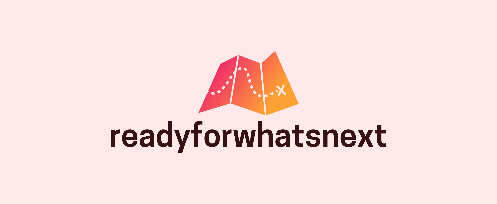

## Purpose
The purpose of readyforwhatsnext is to integrate the [Springtides](/project/b_springtides-project/), [Spring To Mind](/project/c_springtolife-project/), [On Target](/project/d_ontarget-project/) and [First Bounce](/project/e_firstbounce-project/) models in a hybrid, multi-method model of the systems that shape the mental health of young people.

## Published output
Publicly available output to date is available in the form of reports.

### Reports
Early scoping work that informed the decision to adopt a multi-method, modular systems model included:

- Our work to develop a conceptual model of resilience relevant to policymakers, summarised in [this poster](https://dataverse.harvard.edu/file.xhtml?fileId=4419933&version=1.0#); and
- A report about a [framework for financing population level improvements in youth mental health](https://www.orygen.org.au/About/Orygen-Global/Files/Orygen-WEF-investment-framework.aspx).

## Future releases
The priority development priority for readyforwhatsnext is to produce software and datasets that provide an initial proof of concept systems model. However, this will only occur once all four component models (Springtides, Spring To Mind, On Target and First Bounce) have reached their respective development milestones.